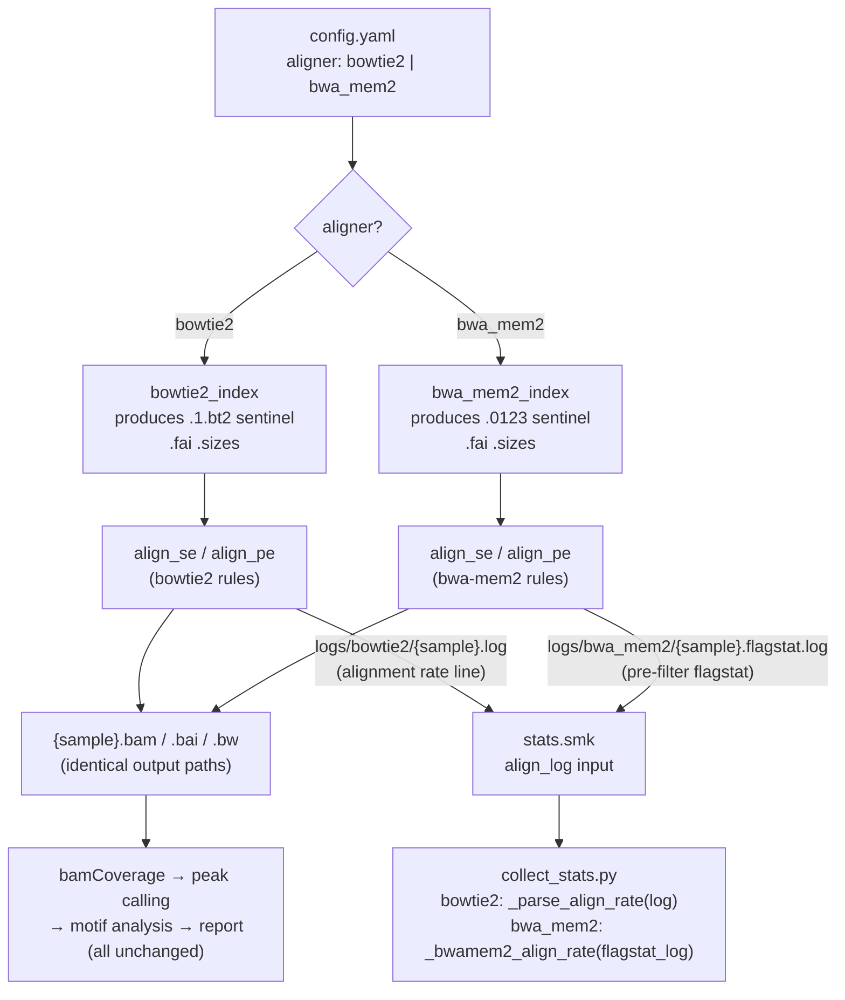

# feat: Add bwa-mem2 as a configurable aligner

## Summary

Add `bwa-mem2` as a user-selectable alternative to `bowtie2` for read alignment. A new top-level `aligner` config key (`bowtie2` | `bwa_mem2`, default `bowtie2`) routes SE and PE alignment through the chosen tool at DAG-build time via compile-time conditional rule registration. All downstream rules (trimming, peak calling, motif analysis, stats, reporting) are unchanged. The six implementation units cover: config schema, container dependency, a new `bwa_mem2_index` rule, conditional alignment rules, dynamic log-path resolution in `stats.smk`, and bwa-mem2-aware alignment-rate parsing in `collect_stats.py`.

---

## Problem Frame

The pipeline hard-wires `bowtie2` for read alignment. Users who need `bwa-mem2` for methodological consistency with other workflows — or for its speed on very large genomes — have no supported path. This plan adds `bwa-mem2` as a first-class alternative with zero impact on downstream processing.

**Scope boundary:** Only the alignment step (index build + align rules + log parsing) changes. Output BAM paths, wildcard constraints, and all downstream rules are identical regardless of aligner.

---

## Requirements

- **R1** — A new `aligner` config key accepts `bowtie2` (default) or `bwa_mem2`.
- **R2** — When `aligner: bwa_mem2`, the `bwa_mem2_index` rule builds the reference index and `align_se`/`align_pe` use `bwa-mem2 mem`.
- **R3** — When `aligner: bowtie2` (or key absent), behavior is byte-for-byte identical to the current pipeline.
- **R4** — BAM output paths and all downstream rule inputs are identical regardless of aligner.
- **R5** — The `alignment_rate` stat in the stats CSV is populated for both aligners.
- **R6** — `bwa-mem2` is available inside the Apptainer container.

---

## Key Technical Decisions

**KTD1 — Compile-time conditional rule registration**
Wrap the existing `align_se`/`align_pe` rules in `if config.get("aligner", "bowtie2") == "bowtie2":` and add an `elif` block for `bwa_mem2`. The same conditional is applied to `bowtie2_index` in `ref.smk` to prevent an `AmbiguousRuleException`: both index rules produce `.fai` and `.sizes` at the same paths, so both rules must not be active simultaneously. This follows the existing `homer_annotate` conditional pattern. Aligner selection is enforced at module load time, not inside a shell block.

**KTD2 — bwa-mem2 alignment rate from the pre-filter SAM stream**
`bwa-mem2` does not write an "X% overall alignment rate" line to stderr. Running `samtools flagstat` on the **finished BAM** is not a valid substitute: the BAM is already MAPQ-filtered (`samtools view -F 4 -q {mapq}`), so flagstat on it returns ~100% for nearly every sample — a meaningless QC metric. Instead, the bwa-mem2 shell block captures alignment statistics from the **unfiltered SAM stream before the MAPQ filter step**, using `tee` with process substitution to write `samtools flagstat -` output to a separate named log entry (`log.flagstat`). `collect_stats.py` parses that pre-filter flagstat file to compute alignment rate. An `aligner` param is added to both stats rules so `collect_stats.py` can branch on parse strategy.

**KTD3 — `.fai` and `.sizes` produced by both index rules**
`.fai` and `.sizes` are currently side-effects of `bowtie2_index`. Because `bowtie2_index` is gated (KTD1), `bwa_mem2_index` must also produce them so downstream references to these files are always satisfied. Both rules run the same two commands (`samtools faidx` + `cut -f1,2`). Refactoring into a shared `genome_prep` rule is deferred.

**KTD4 — Aligner-named log directories**
bowtie2 logs stay in `logs/bowtie2/`; bwa-mem2 logs go to `logs/bwa_mem2/`. This matches the existing per-tool naming convention. `stats.smk` resolves the log path at DAG-build time using the same `config.get("aligner", "bowtie2")` check.

---

## High-Level Technical Design



---

## Scope Boundaries

### In scope
- Config schema: `aligner` key, `bwa_mem2` params block, resource entries
- Container: `bwa-mem2` in `apptainer_build/pixi.toml`
- Conditional `bowtie2_index` + new `bwa_mem2_index` rule in `workflow/rules/ref.smk`
- Conditional `align_se`/`align_pe` rule pairs in `workflow/rules/align.smk`
- Dynamic log-path and `aligner` param in `workflow/rules/stats.smk`
- bwa-mem2-aware alignment-rate parsing in `workflow/scripts/collect_stats.py`

### Deferred to Follow-Up Work
- Refactoring `.fai`/`.sizes` generation into a shared `genome_prep` rule
- README update (`snakemake bowtie2_index` invocation example now applies to both index rules)
- Integration tests / pytest coverage for the new alignment branch
- Benchmarking bwa-mem2 vs. bowtie2 alignment quality on a real DAP-seq dataset

### Out of scope
- Additional aligners (STAR, HISAT2, etc.)
- Changes to trimming, peak calling, motif analysis, or reporting
- Container rebuild automation (user runs `apptainer build` after `pixi.toml` change)

---

## Implementation Units

### U1. Config schema — add `aligner` key and `bwa_mem2` params

**Goal:** Extend `config/config.yaml` with the aligner selector, bwa-mem2 tool params, and resource entries.

**Requirements:** R1, R2, R3

**Dependencies:** none

**Files:**
- `config/config.yaml`

**Approach:**
- Add `aligner: bowtie2` as a top-level key immediately after `genome_size` and before the `threads` block, keeping genome-related keys together.
- Add a `bwa_mem2:` mapping with `extra: ""` and `extra_index: ""` sub-keys, placed adjacent to the existing `bowtie2:` block.
- Add two resource entries under `resources:`:
  - `bwa_mem2_index:` mirroring `bowtie2_index` defaults (`mem_mb: 8000`, `runtime: 60`)
  - `bwa_mem2_align:` mirroring `trim_align` defaults (`mem_mb: 16000`, `runtime: 120`) — used by new align rules instead of `trim_align`

**Patterns to follow:** Existing `bowtie2:` and `resources.bowtie2_index:` entries.

**Test scenarios:**
- Happy path: Snakemake `--dry-run` builds the DAG without error when `aligner: bowtie2`.
- Happy path: Snakemake `--dry-run` builds the DAG without error when `aligner: bwa_mem2`.
- Edge case: A user config that omits `aligner` entirely falls back to bowtie2 via `config.get("aligner", "bowtie2")`.

**Verification:** `pixi run snakemake --snakefile workflow/Snakefile --configfile config/config.yaml --dry-run` succeeds for both aligner values with no missing-key errors.

---

### U2. Container — add bwa-mem2 dependency

**Goal:** Make `bwa-mem2` available inside the Apptainer container.

**Requirements:** R6

**Dependencies:** none (parallelizable with U1)

**Files:**
- `apptainer_build/pixi.toml`

**Approach:**
- Add `bwa-mem2 = "*"` to the `[dependencies]` block, adjacent to `bowtie2 = "*"`.
- No version pin; consistent with the `bowtie2 = "*"` policy. The package resolves as `bwa-mem2` in bioconda on linux-64.

**Patterns to follow:** `bowtie2 = "*"` entry.

**Test expectation:** none at unit level — validated when `dapseq.sif` is rebuilt.

**Verification:** After `apptainer build`, run `apptainer exec dapseq.sif bwa-mem2 version` and confirm a version string is returned.

---

### U3. Reference index — conditional index rules in `ref.smk`

**Goal:** Gate `bowtie2_index` on the aligner config key and add a `bwa_mem2_index` rule, preventing the `AmbiguousRuleException` that would arise from two rules producing `.fai` and `.sizes` at the same paths.

**Requirements:** R2, R3

**Dependencies:** U1 (config must define `bwa_mem2.extra_index` and `resources.bwa_mem2_index`)

**Files:**
- `workflow/rules/ref.smk`

**Approach:**
- Add `_aligner = config.get("aligner", "bowtie2")` at the top of the file.
- Wrap the existing `bowtie2_index` rule in `if _aligner == "bowtie2":`.
- Add `elif _aligner == "bwa_mem2":` block containing `rule bwa_mem2_index:` with:
  - Input: `config["genome_ref"]` (the genome FASTA).
  - Output (named): `idx = config["genome_ref"] + ".0123"` (sentinel for align rules), plus `{ref}.amb`, `{ref}.ann`, `{ref}.bwt.2bit.64`, `{ref}.pac`, `{ref}.fai`, `{ref}.sizes`.
  - Params: `extra_index = config["bwa_mem2"].get("extra_index", "")`.
  - Resources: draw from `config["resources"]["bwa_mem2_index"]`.
  - Shell (`set -euo pipefail`): `bwa-mem2 index {params.extra_index} {input}`, then `samtools faidx {input}`, then `cut -f1,2 {input}.fai > {output.sizes}`.
  - Log: `OUT + "/logs/bwa_mem2_index.log"`.

**Patterns to follow:** `bowtie2_index` rule structure; `homer_annotate` conditional pattern.

**Test scenarios:**
- Happy path (bowtie2): `--dry-run` resolves `bowtie2_index`; `bwa_mem2_index` does not appear in the DAG.
- Happy path (bwa-mem2): `--dry-run` resolves `bwa_mem2_index`; `bowtie2_index` does not appear in the DAG.
- Happy path: On a small test FASTA with `aligner: bwa_mem2`, the `.0123` sentinel file is created.
- Happy path: `.fai` and `.sizes` are produced regardless of which aligner is selected.
- No regression: Both index rules produce identical `.fai` and `.sizes` content from the same FASTA.

**Verification:** `pixi run snakemake bwa_mem2_index --dry-run` resolves cleanly (no ambiguity errors); the `.0123` file exists after a real run.

---

### U4. Alignment rules — conditional bwa-mem2 SE/PE rules

**Goal:** Gate `align_se`/`align_pe` on `config["aligner"]` at DAG-build time, registering either the bowtie2 or bwa-mem2 rule pair.

**Requirements:** R2, R3, R4

**Dependencies:** U1, U3

**Files:**
- `workflow/rules/align.smk`

**Approach:**
- Add `_aligner = config.get("aligner", "bowtie2")` at the top of the file.
- Wrap the existing `align_se` and `align_pe` rules in `if _aligner == "bowtie2":`.
- Add `elif _aligner == "bwa_mem2":` with two new rules sharing the same rule names, wildcard constraints, output paths, and bamCoverage block as the bowtie2 variants. Key differences in the bwa-mem2 variants:
  - `input: idx = config["genome_ref"] + ".0123"` (bwa-mem2 DAG sentinel; dependency tracking only).
  - `params: idx = config["genome_ref"]` (bare genome path, same as bowtie2 — this is the prefix passed to `bwa-mem2 mem`, not the `.0123` file).
  - `params: extra = config["bwa_mem2"].get("extra", "")`.
  - `resources: mem_mb = config["resources"]["bwa_mem2_align"]["mem_mb"]`.
  - Log: `align = OUT + "/logs/bwa_mem2/{sample}.log"` and `flagstat = OUT + "/logs/bwa_mem2/{sample}.flagstat.log"`.
  - Shell alignment: `bwa-mem2 mem -t {threads} {params.idx} {input.r1} 2>{log.align}` (SE; append `{input.r2}` for PE), then tee the unfiltered SAM through `samtools flagstat - > {log.flagstat}` **before** the MAPQ filter, then pipe to the same `samtools view -F 4 -q {params.mapq} | samtools sort` chain. The exact bash idiom for the tee/process-substitution step (handling `set -euo pipefail`) is an implementation-time detail; the intent is to capture alignment statistics from the pre-filter stream.
- Add `else: raise ValueError(f"Unknown aligner: '{_aligner}'. Must be 'bowtie2' or 'bwa_mem2'.")` to catch misconfiguration at DAG-build time.
- The bamCoverage shell block is identical to the bowtie2 variant in both new rules.

**Patterns to follow:** Existing `align_se`/`align_pe` in `workflow/rules/align.smk`; `homer_annotate` conditional pattern.

**Test scenarios:**
- Happy path (bowtie2): Dry-run resolves `align_se`/`align_pe` using the `.1.bt2` sentinel; no regression.
- Happy path (bwa-mem2): Dry-run resolves `align_se`/`align_pe` using the `.0123` sentinel.
- Regression: Output paths `{sample}.bam`, `{sample}.bam.bai`, `{sample}.bw` are identical for both aligners.
- Edge case: SE-only sample with `aligner: bwa_mem2` routes through the SE rule (wildcard constraint on `SE_SAMPLES`).
- Edge case: PE-only sample with `aligner: bwa_mem2` routes through the PE rule.
- Happy path: `{sample}.flagstat.log` is non-empty after a real bwa-mem2 run (confirms pre-filter flagstat captured data).
- Error path: `aligner: hisat2` raises a clear error at DAG-build time, not silently at runtime.

**Verification:** Dry-run succeeds for both aligner values; a real bwa-mem2 run produces a non-empty sorted BAM that passes `samtools quickcheck`, and `{sample}.flagstat.log` contains a "mapped" line.

---

### U5. Stats rules — dynamic log paths and `aligner` param

**Goal:** Update `sample_stats_treatment` and `sample_stats_control` to resolve log paths per aligner and pass `aligner` as a param.

**Requirements:** R5

**Dependencies:** U4 (log paths established per aligner)

**Files:**
- `workflow/rules/stats.smk`

**Approach:**
- Add module-level expressions at the top:
  ```
  _align_log_dir = "bwa_mem2" if config.get("aligner", "bowtie2") == "bwa_mem2" else "bowtie2"
  _is_bwa_mem2 = config.get("aligner", "bowtie2") == "bwa_mem2"
  ```
- Replace `align_log = OUT + "/logs/bowtie2/{sample}.log"` in both rules with `align_log = OUT + f"/logs/{_align_log_dir}/{{sample}}.log"`.
- For bwa-mem2, also add `flagstat_log = OUT + "/logs/bwa_mem2/{sample}.flagstat.log"` as an input in both rules, conditionally present when `_is_bwa_mem2`. Use a lambda or module-level conditional to avoid adding the field for bowtie2 runs.
- Add `aligner = config.get("aligner", "bowtie2")` to the `params:` block of both stats rules.

**Patterns to follow:** `params: is_pe = lambda wc: wc.sample in PE_SAMPLES` for conditional param/input patterns.

**Test scenarios:**
- Happy path (bowtie2): `align_log` resolves to `logs/bowtie2/{sample}.log`; no `flagstat_log` input.
- Happy path (bwa-mem2): `align_log` resolves to `logs/bwa_mem2/{sample}.log`; `flagstat_log` resolves to `logs/bwa_mem2/{sample}.flagstat.log`.
- Integration: Both stats rules pass `aligner` to the `script:` directive without error; `sm.params.aligner` is accessible in `collect_stats.py`.

**Verification:** Dry-run with `aligner: bwa_mem2` shows both log paths in the job's input list for treatment and control stats rules.

---

### U6. `collect_stats.py` — bwa-mem2 alignment rate parsing

**Goal:** Add a `_bwamem2_align_rate` function and branch in `main()` so `alignment_rate` is populated regardless of aligner.

**Requirements:** R5

**Dependencies:** U5 (provides `sm.params.aligner` and `sm.input.flagstat_log`)

**Files:**
- `workflow/scripts/collect_stats.py`

**Approach:**
- Add `_bwamem2_align_rate(flagstat_log)` after the existing `_parse_align_rate` function. It reads the flagstat log file (the pre-filter output written by U4's shell block) and parses the mapped-reads line with `r"(\d+) \+ \d+ mapped \((\d+\.\d+)%"`, returning the percentage as a rounded string or `NA` if the pattern is absent. When `samtools flagstat` emits `N/A` for zero-mapped reads, the pattern will not match and the function correctly returns `NA`.
- In `main()`, branch on `sm.params.aligner`:
  - `"bwa_mem2"` → `_bwamem2_align_rate(sm.input.flagstat_log)`
  - `else` → `_parse_align_rate(sm.input.align_log)` (unchanged)

**Patterns to follow:** `_parse_align_rate` file-read pattern in `workflow/scripts/collect_stats.py`.

**Test scenarios:**
- Happy path (bowtie2): Existing `_parse_align_rate` behavior is unchanged; returns a "95.42"-style string.
- Happy path (bwa-mem2): `_bwamem2_align_rate` parses a pre-filter flagstat file containing a mapped line and returns a numeric percentage string.
- Edge case: flagstat reports 0 mapped reads — flagstat emits `"N/A"` not `"0.00%"` in this case; function returns `NA` (correct sentinel behavior, not `"0.0"`).
- Edge case: flagstat output does not match the expected pattern (e.g., unexpected samtools version format) → returns `NA`.
- Integration: `alignment_rate` column in the output stats CSV reflects pre-filter alignment rate (not a post-filter ~100% value) on a real bwa-mem2 run.

**Verification:** On a real bwa-mem2 run, `alignment_rate` in the stats CSV is a value meaningfully below 100% (reflecting actual unaligned reads), consistent with what bowtie2 reports on the same library.

---

## Open Questions

| # | Question | Owner |
|---|---|---|
| Q1 | Does bwa-mem2's pre-filter flagstat alignment rate fall in the expected range for typical DAP-seq experiments? | Verify on first real run |

---

## Risks & Dependencies

| Risk | Likelihood | Impact | Mitigation |
|---|---|---|---|
| `tee`/process-substitution pattern interacts poorly with `set -euo pipefail` | Medium | Medium | Test the shell idiom on a small FASTA before integrating; alternative: write an intermediate unfiltered SAM/BAM if tee proves unreliable |
| Container must be rebuilt before any pipeline testing | Certain | Medium | Document rebuild requirement; block U3-U6 testing on a rebuilt container |
| bowtie2 regression from wrapping index and align rules in conditionals | Low | High | Explicit dry-run regression test required in U3 and U4 |
| `.fai`/`.sizes` content differs between index runs | Very low | Low | Both rules use identical `samtools faidx` + `cut` commands; content is deterministic from the FASTA |
