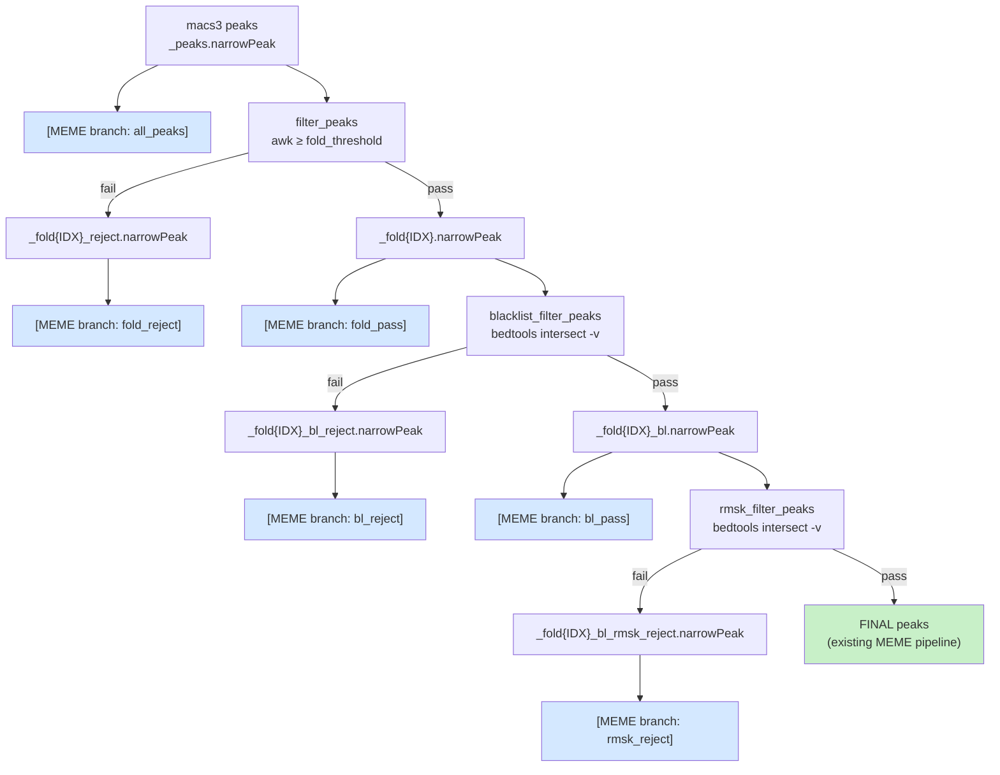

# feat: Add filter-stage branch MEME/FIMO analysis

## Summary

Extend the motif analysis pipeline so that MEME + FIMO runs at every stage in the post-peak-calling filter chain, not just on the final passing peaks. At each stage the pipeline produces a **pass** set (peaks that survived the filter) and a **reject** set (peaks that did not). Both get the full MEME → logo → FIMO treatment. One additional run covers all pre-filter peaks. Assumes BL and RMSK filters are always enabled. Experimental — will be deleted after testing.

---

## Problem Frame

Currently `meme`/`fimo` run only on the final fully-filtered peak set (`get_final_filtered_peaks`). There is no visibility into whether peaks removed by fold-change, blacklist, or rmsk filters carry motif signal. This plan adds branch analysis at every filtering stage so motif content can be compared across the entire filtering hierarchy.

---

## Requirements

- R1: Run MEME + FIMO on all pre-filter MACS peaks (`_peaks.narrowPeak`).
- R2: Run MEME + FIMO on both passing and rejected peak sets at every filtering stage.
- R3: The final fully-filtered passing set (existing MEME pipeline) must not be duplicated.
- R4: Reject peak files are derived by inverting the existing filter logic (no new external tools).
- R5: Branch outputs live under `meme/{sample}/{filter_stage}/` and `fimo/{sample}/{filter_stage}/`.

---

## Key Technical Decisions

**KTD-1: Single fold level (MEME_FOLD_IDX), not all three.**
Only `fold{MEME_FOLD_IDX}` feeds the blacklist/rmsk chain; the other levels are not used.

**KTD-2: `filter_stage` wildcard drives branch FASTA/MEME/FIMO.**
One set of branch rules parameterizes by a `filter_stage` wildcard. `get_branch_peak_file(wc)` maps each stage name to its narrowPeak path, avoiding rule duplication.

**KTD-3: Reject file naming appends `_reject` to the passing file's name.**
e.g. `_fold{IDX}_reject`, `_fold{IDX}_bl_reject`, `_fold{IDX}_bl_rmsk_reject`.

**KTD-4: Reject rules reuse existing resource config keys.**
`fold_reject_peaks` reuses `filter_peaks`; `bl_reject_peaks` reuses `blacklist_filter_peaks`; `rmsk_reject_peaks` reuses `rmsk_filter_peaks`.

**KTD-5: BL and RMSK assumed always enabled.**
No conditional logic. `BRANCH_STAGES` is a hardcoded constant. All six stages always run.

---

## Scope Boundaries

### In scope
- Three new reject narrowPeak rules (fold, BL, RMSK).
- New FASTA/MEME/MEME-logo/FIMO branch rules using a `filter_stage` wildcard.
- New target rule `motifs_branches_done` wired into `rule all`.
- `filter_stage` added to global `wildcard_constraints`.

### Out of scope
- Conditional handling for configs with BL or RMSK disabled.
- MEME branches on all three fold levels.
- `factorbook_logo` branches.
- Reporting/QC integration.

---

## High-Level Technical Design

Each `[MEME branch]` node represents: `narrow_peak_to_fasta_branch` → `meme_branch` → `meme_logo_branch` + `fimo_branch`.

`BRANCH_STAGES` is the fixed constant `["all_peaks", "fold_reject", "fold_pass", "bl_reject", "bl_pass", "rmsk_reject"]`.

---

## Implementation Units

### U1. Generate reject narrowPeak files

**Goal:** Produce narrowPeak files for peaks that fail each filter step.

**Requirements:** R4

**Dependencies:** none (reads `macs3` output and existing passing filter files directly)

**Files:**
- `workflow/rules/peaks.smk`

**Approach:**
Add three new unconditional rules:

- `fold_reject_peaks`: `awk -v FCH=... '$7 < FCH'` on `_peaks.narrowPeak` → `_peaks_fold{MEME_FOLD_IDX}_reject.narrowPeak`. Threshold is `FOLD_LEVELS[MEME_FOLD_IDX - 1]`.
- `bl_reject_peaks`: `bedtools intersect` **without** `-v` on `_peaks_fold{MEME_FOLD_IDX}.narrowPeak` + blacklist → `_peaks_fold{MEME_FOLD_IDX}_bl_reject.narrowPeak`.
- `rmsk_reject_peaks`: same zcat+awk pipeline as `rmsk_filter_peaks` but **without** `-v` → `_peaks_fold{MEME_FOLD_IDX}_bl_rmsk_reject.narrowPeak`. Input uses `get_pre_rmsk_peaks` (already defined in `common.smk`).

No `if config.get(...)` guards — all three rules are always present.

**Patterns to follow:** `blacklist_filter_peaks` and `rmsk_filter_peaks` in `peaks.smk` — identical logic, just remove the `-v` flag.

**Test scenarios:**
- Fold reject: all peaks in reject file have `$7 < FOLD_LEVELS[MEME_FOLD_IDX-1]`; fold reject + fold pass = all peaks (no overlap).
- BL reject: all peaks in reject file overlap the blacklist BED; BL reject + BL pass = fold peaks.
- RMSK reject: all peaks in reject file overlap rmsk intervals; RMSK reject + RMSK pass = pre-rmsk peaks.
- Empty input: reject file is created and empty, no error.

**Verification:** `bedtools intersect -u -a reject.narrowPeak -b pass.narrowPeak | wc -l` equals zero for each stage.

---

### U2. BRANCH_STAGES and helper functions in common.smk

**Goal:** Define the fixed branch stage list and the narrowPeak lookup function.

**Requirements:** R2, R3, R5

**Dependencies:** U1

**Files:**
- `workflow/rules/common.smk`

**Approach:**
After the existing `PEAKS_FILTER_SUFFIX` block, add:

1. **`BRANCH_STAGES`** — hardcoded constant: `["all_peaks", "fold_reject", "fold_pass", "bl_reject", "bl_pass", "rmsk_reject"]`. No conditional logic.

2. **`get_branch_peak_file(wc)`** — simple dict lookup keyed on `wc.filter_stage` and using `wc.sample`. Six fixed entries:
   - `all_peaks` → `_peaks.narrowPeak`
   - `fold_reject` → `_peaks_fold{MEME_FOLD_IDX}_reject.narrowPeak`
   - `fold_pass` → `_peaks_fold{MEME_FOLD_IDX}.narrowPeak`
   - `bl_reject` → `_peaks_fold{MEME_FOLD_IDX}_bl_reject.narrowPeak`
   - `bl_pass` → `_peaks_fold{MEME_FOLD_IDX}_bl.narrowPeak`
   - `rmsk_reject` → `_peaks_fold{MEME_FOLD_IDX}_bl_rmsk_reject.narrowPeak`

3. **`wildcard_constraints`** — add `filter_stage = "all_peaks|fold_pass|fold_reject|bl_pass|bl_reject|rmsk_reject"` to the existing block.

4. **`motifs_branches_done` target rule** — expands `TREATMENT_SAMPLES × BRANCH_STAGES × ["summits", "peaks"]` for `meme/{s}/{fs}/{pt}/logo1.png` and `fimo/{s}/{fs}/{pt}/fimo.tsv`.

**Patterns to follow:** `get_final_filtered_peaks` for the lookup function shape.

**Test scenarios:**
- `BRANCH_STAGES` has exactly 6 entries.
- `get_branch_peak_file` returns a valid path for each of the 6 stages.

**Verification:** `snakemake --dry-run motifs_branches_done` resolves without ambiguous wildcard errors.

---

### U3. Branch FASTA generation rule

**Goal:** Convert branch narrowPeak files to FASTA for MEME input.

**Requirements:** R1, R2, R5

**Dependencies:** U1, U2

**Files:**
- `workflow/rules/motifs.smk`

**Approach:**
Add `narrow_peak_to_fasta_branch` rule. Identical to `narrow_peak_to_fasta` except:
- Input `narrowpeak` uses `get_branch_peak_file`.
- Output: `OUT + "/fasta/{sample}.{filter_stage}.{peak_type}.fasta"`.
- Log path includes `{filter_stage}`.

Same script (`narrow_peak_to_fasta.py`), same params, same resource key.

**Patterns to follow:** Existing `narrow_peak_to_fasta` rule in `motifs.smk`.

**Test scenarios:**
- Non-empty narrowPeak → non-empty FASTA; empty narrowPeak → empty FASTA file created (not missing).
- Summits mode: sequences of length `2 × summit_extend`; peaks mode: full-peak sequences.
- `chrom_filter` exclusions respected.

**Verification:** `fasta/{sample}.{filter_stage}.*.fasta` files present for all 6 stages after a run.

---

### U4. Branch MEME and logo rules

**Goal:** Run MEME motif discovery and render logos for every branch FASTA.

**Requirements:** R1, R2, R5

**Dependencies:** U3

**Files:**
- `workflow/rules/motifs.smk`

**Approach:**
Add two rules:

**`meme_branch`** — input `fasta/{sample}.{filter_stage}.{peak_type}.fasta`; outputs `meme/{sample}/{filter_stage}/{peak_type}/meme.txt` and `meme.xml`. Shell body identical to `meme_summits`/`meme_peaks` (same params, empty-file guard, optional custom alphabet). `outdir = OUT + "/meme/{sample}/{filter_stage}/{peak_type}"`.

**`meme_logo_branch`** — input `meme/{sample}/{filter_stage}/{peak_type}/meme.txt`; outputs `logo1.png` and `logo_rc1.png`. Uses the same `render_meme_logo.py` script.

Both reuse `config["resources"]["meme"]`.

**Patterns to follow:** `meme_summits`, `meme_peaks`, `meme_logo_summits`, `meme_logo_peaks`.

**Test scenarios:**
- Empty FASTA: output files touched, no error.
- Non-empty FASTA: `meme.txt` has `MEME version` header; `meme.xml` is valid XML.
- Logo produced when `meme.txt` non-empty; no error when touched.

**Verification:** `meme/{sample}/{filter_stage}/{peak_type}/logo1.png` present for all 6 stages × 2 peak types.

---

### U5. Branch FIMO rule

**Goal:** Scan branch FASTA files against their branch MEME motif.

**Requirements:** R1, R2

**Dependencies:** U3, U4

**Files:**
- `workflow/rules/motifs.smk`

**Approach:**
Add `fimo_branch` rule. Inputs: `meme/{sample}/{filter_stage}/{peak_type}/meme.xml` + `fasta/{sample}.{filter_stage}.{peak_type}.fasta`. Output: `fimo/{sample}/{filter_stage}/{peak_type}/fimo.tsv`. Shell body identical to existing `fimo` rule. `outdir = OUT + "/fimo/{sample}/{filter_stage}/{peak_type}"`. Reuses `config["resources"]["fimo"]`.

**Patterns to follow:** Existing `fimo` rule in `motifs.smk`.

**Test scenarios:**
- Empty MEME XML: output TSV touched, no error.
- Non-empty MEME XML: `fimo.tsv` has header and at least one data row.

**Verification:** `fimo/{sample}/{filter_stage}/{peak_type}/fimo.tsv` present for all 6 stages.

---

### U6. Wire branches into rule all

**Goal:** Ensure `snakemake all` includes branch motif outputs.

**Requirements:** R5 (implied — always-on)

**Dependencies:** U2

**Files:**
- `workflow/Snakefile`

**Approach:**
Add `rules.motifs_branches_done.input` to the `input:` block of `rule all`. No conditional guard needed.

**Patterns to follow:** Existing `rules.motifs_done.input` in `rule all`.

**Verification:** `snakemake --dry-run all 2>&1 | grep -c "filter_stage"` > 0.
