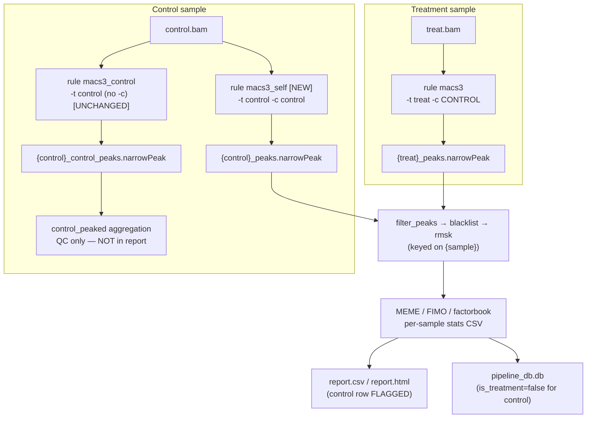

# feat: Run control against itself in MACS and include it in the report

## Summary

Today the control sample is peak-called **once** — by itself with no input control
(`rule macs3_control`, output `{control}_control_peaks.narrowPeak`) — and is deliberately
**excluded** from the report table (`report.csv` / `report.html`), which only iterates
`TREATMENT_SAMPLES`.

This plan adds a **second** MACS run for the control: control **against itself**
(`-t control -c control`), which should yield few or no peaks. The control is then
treated as a full sample from that run onward — filtered peaks, FRiP, MEME/FIMO motif
discovery, and a row in the report — while being **visually flagged** as the control so it
is not mistaken for a treatment sample. The existing no-input self peak-call is kept
unchanged.

Net effect: the control passes through MACS **twice** (no-input self-call *and*
against-itself), and the against-itself run flows through the normal treatment pipeline
into the report.

---

## Problem Frame

The control is a member of `SAMPLES` (it is trimmed, aligned, indexed, gets idxstats, a
no-input self peak-call, and a control-only stats CSV) but is excluded from
`TREATMENT_SAMPLES`. That exclusion is the single lever that keeps it out of the treatment
MACS run, the motif pipeline, and the report. The request is to give the control a
sample-equivalent presence — sourced from a MACS run where the control is its own
background — without disturbing its role as the `-c` background for real treatment samples
and without dropping the existing no-input self peak-call.

A treatment sample and a "control-against-itself" sample differ in exactly one place: the
MACS `-c` argument. Everything downstream of `{sample}_peaks.narrowPeak`
(`filter_peaks`, blacklist/rmsk filtering, FRiP, MEME/FIMO, factorbook logo, HOMER, report
columns, HTML logos) keys purely on the `{sample}` wildcard, so once the control produces a
`{control}_peaks.narrowPeak` via a self-input run and is added to the relevant sample sets,
the rest of parity largely follows.

---

## Requirements

- **R1** — Keep the existing no-input control peak-call (`rule macs3_control`,
  `{control}_control_peaks.narrowPeak`, aggregated by `control_peaked`) exactly as-is.
- **R2** — Add a new MACS run for each control sample using **itself** as both treatment
  and control (`-t {control}.bam -c {control}.bam`), producing the standard
  `{control}_peaks.narrowPeak` / `{control}_summits.bed`.
- **R3** — Route the control through the full treatment-style downstream from the
  against-itself run: fold/blacklist/rmsk filtering, per-sample stats (peaks, FRiP,
  motif_peaks), and MEME/FIMO/factorbook motif discovery.
- **R4** — Include the control as a row in `report.csv` and `report.html`, sourced from the
  against-itself run, alongside treatment samples.
- **R5** — Visually flag the control row in the HTML report so it is distinguishable from
  treatment samples.
- **R6** — Preserve the control's role as the `-c` background for treatment samples
  (`rule macs3`) and as `-b2` for `bamcompare`; preserve `merge_control` behavior.
- **R7** — No config key required to opt in — the behavior is automatic whenever a
  `control` is configured (see KTD-4 for the always-on decision).

---

## High-Level Technical Design

The control now has two MACS paths; only the against-itself path feeds the report.

Key structural moves:
1. A new `rule macs3_self` (constrained to control samples) produces the standard
   `{sample}_peaks.narrowPeak` from a self-input run; `rule macs3` is constrained to
   treatment samples so the two never collide on that output.
2. A single sample set — `REPORT_SAMPLES = TREATMENT_SAMPLES + CONTROL_SAMPLES` — drives
   the peak/motif/report/stats aggregations and the per-rule wildcard constraints that were
   previously treatment-only.
3. The report gains the control row and flags it; the DB records it with
   `is_treatment=false` but now populates its (now-existing) peak/motif file paths.

---

## Key Technical Decisions

- **KTD-1: Dedicated `macs3_self` rule rather than reusing `rule macs3` for the control.**
  `rule macs3` derives its `-c` from the global `CONTROL` basename, which is
  `merged_control` when more than one control is configured — that would run each control
  against the *merged* background, not against *itself*, and `merged_control` is not a
  configured sample. A dedicated rule that passes `-c {sample}.bam` makes "against itself"
  literal and correct for both single- and multi-control experiments. It also lets us give
  `rule macs3` a `TREATMENT_SAMPLE_CONSTRAINT` and `macs3_self` a
  `CONTROL_SAMPLE_CONSTRAINT` over the shared `{sample}_peaks.narrowPeak` output, so
  Snakemake sees disjoint rules with no ambiguity.

- **KTD-2: `macs3_self` uses `-n {sample}` (not a `_self` suffix).** The output must be
  `{control}_peaks.narrowPeak` (the standard treatment name) so the entire existing
  downstream — `filter_peaks`, blacklist/rmsk, `narrow_peak_to_fasta`, MEME, FIMO, stats —
  picks it up unchanged via the `{sample}` wildcard. The no-input run keeps its distinct
  `{control}_control_peaks.narrowPeak` name, so the two runs never overwrite each other.

- **KTD-3: Unify per-sample stats onto one rule.** The control now has peaks/folds/FIMO
  just like a treatment sample, so `sample_stats_control` (the minimal, no-peaks variant) is
  removed and `sample_stats_treatment` is broadened to cover `REPORT_SAMPLES`. Peak-stat
  computation in `collect_stats.py` is gated by the `is_treatment` param, which is passed
  `True` for every peak-called sample (all report samples now have peaks). The DB's
  semantic `is_treatment` flag is derived separately from config, so this does not mislabel
  the control.

- **KTD-4: Always-on, no opt-in config key.** The user asked for this behavior directly, so
  it applies automatically whenever a `control` is set. Trade-off: MEME/FIMO run on the
  control every pipeline invocation even though it is expected to have ~0 peaks, adding some
  compute. An opt-out flag (`control_self_peaks: true`) is captured in Deferred as a
  reversible follow-up if the cost proves unwelcome.

- **KTD-5: Flag the control in HTML only; do not add a `report.csv` column.** The report
  column contract (`report.make_cols()` / `collect_stats.COLUMNS` / `update_db.COLS`) is
  pinned by exact-order unit tests and read positionally by the DB. Flagging is a
  human-facing presentation need (R5), so it lives in `report.html` (row CSS class + a
  "control" badge + a header legend). The control remains identifiable in structured data
  via its name and the DB's `is_treatment=false` column — no new CSV column, no test churn
  on column order.

- **KTD-6: Report ordering places control rows last.** `REPORT_SAMPLES` is defined as
  `TREATMENT_SAMPLES + CONTROL_SAMPLES` so controls sort to the bottom of the table by
  default (the HTML table remains client-sortable).

---

## Implementation Units

### U1. Define `REPORT_SAMPLES` and route control into peak/motif/report aggregations

**Goal:** Introduce the combined sample set and point the treatment-only aggregation rules
at it, so the control's peak and motif outputs become build targets. Keep the no-input
`control_peaked` aggregation unchanged.

**Requirements:** R3, R4, R6

**Dependencies:** none

**Files:**
- `workflow/rules/common.smk`

**Approach:**
- Add `REPORT_SAMPLES = TREATMENT_SAMPLES + CONTROL_SAMPLES` near the existing set
  definitions (after line 83). Order matters (KTD-6): treatment first, controls last.
- Add a matching constraint string `REPORT_SAMPLE_CONSTRAINT = "|".join(REPORT_SAMPLES) if REPORT_SAMPLES else "(?!)"`
  for reuse by broadened per-rule constraints (U3, U4).
- Change `rule peaked` (lines 190-195), `rule motifs_done` (lines 203-211), and
  `rule annotate_done` (lines 222-227) to expand over `REPORT_SAMPLES` instead of
  `TREATMENT_SAMPLES`.
- Leave `rule control_peaked` (lines 198-200), `rule mapped`, and `rule qc_done` unchanged.

**Patterns to follow:** existing `TREATMENT_SAMPLES` / `CONTROL_SAMPLE_CONSTRAINT`
definitions and the `expand(...)` usage already in these aggregation rules.

**Test scenarios:**
- `Test expectation: none -- Snakemake wiring; covered by the dry-run/DAG check in U8 and
  end-to-end verification. No Python unit surface.`

**Verification:** `pixi run snakemake -n` resolves and the DAG now lists
`{control}_peaks.narrowPeak`, `meme/{control}/...`, and `fimo/{control}/...` as targets.

---

### U2. Add `rule macs3_self`; constrain `rule macs3` to treatment samples

**Goal:** Produce `{control}_peaks.narrowPeak` from a control-against-itself run, and
prevent output-pattern ambiguity between the treatment and control MACS rules.

**Requirements:** R2, R6

**Dependencies:** U1 (constraints reference the new sets)

**Files:**
- `workflow/rules/peaks.smk`

**Approach:**
- Add a `wildcard_constraints: sample = TREATMENT_SAMPLE_CONSTRAINT` block to `rule macs3`
  (lines 5-36) so it only produces treatment `{sample}_peaks.narrowPeak`.
- Add `rule macs3_self`, modeled on `rule macs3` but:
  - `wildcard_constraints: sample = CONTROL_SAMPLE_CONSTRAINT`
  - input is just `sample_bam = OUT + "/bam/{sample}.bam"` (no separate control input)
  - shell runs `macs3 callpeak -t {input.sample_bam} -c {input.sample_bam} ...`
  - `params.name = lambda wc: wc.sample` → output `{sample}_peaks.narrowPeak` /
    `{sample}_summits.bed` (KTD-2), same `--outdir`, `keep_dup`, `extra`, `format`,
    `genome_size`, `tmpdir`, and `resources` as `rule macs3`.
  - log path `OUT + "/logs/macs3_self/{sample}.log"`.
- Leave `rule macs3_control` (lines 39-70) unchanged (R1).

**Patterns to follow:** `rule macs3` and `rule macs3_control` in the same file; the
per-rule `wildcard_constraints` pattern already used by `macs3_control`.

**Test scenarios:**
- Happy path (integration): with a single configured control, `pixi run snakemake -n`
  selects `macs3_self` to build `{control}_peaks.narrowPeak` and `macs3` for treatment
  peaks; no `AmbiguousRuleException`.
- Edge (integration): with `control: null`, `CONTROL_SAMPLE_CONSTRAINT` is `(?!)`, so
  `macs3_self` matches nothing and the DAG is identical to today for treatment samples.
- Edge (integration): with two control samples, `macs3_self` builds a self-input peaks file
  for **each** control (`-t X -c X`, `-t Y -c Y`), independent of `merged_control`.
- `Covers R2.` Behavioral correctness (identical `-t`/`-c` → ~0 peaks) is verified in U8.

**Verification:** dry-run shows both rules with disjoint sample constraints; a real run
produces `{control}_peaks.narrowPeak` with a small/empty peak count.

---

### U3. Broaden treatment-only downstream constraints to include the control

**Goal:** Let the motif/annotation rules that are currently restricted to
`TREATMENT_SAMPLES` also run for control samples.

**Requirements:** R3

**Dependencies:** U1, U2

**Files:**
- `workflow/rules/motifs.smk`
- `workflow/rules/annotation.smk`

**Approach:**
- `rule factorbook_logo` (motifs.smk lines 8-24): change
  `wildcard_constraints: sample = "|".join(TREATMENT_SAMPLES) ...` to use `REPORT_SAMPLES`
  (or `REPORT_SAMPLE_CONSTRAINT`).
- `rule homer_annotate` (annotation.smk lines 2-19): same constraint broadening.
- `rule meme_summits` / `rule meme_peaks` / `rule fimo` / `rule narrow_peak_to_fasta` need
  **no change** — they already key on the unconstrained global `{sample}` wildcard.

**Approach note:** `homer_annotate` is gated on `gene_annotation` and its aggregator
`annotate_done` is **not** part of `rule all`, so HOMER runs for no sample by default;
broadening its constraint is for parity/correctness if a user targets `annotate_done`, not a
default-DAG change. "Full parity" in the default run therefore means MEME/FIMO/factorbook
(reached via `motifs_done` in `rule all`).

**Test scenarios:**
- `Test expectation: none -- constraint-string edits; covered by the U8 dry-run (control
  appears as a valid target for factorbook_logo and, when annotation is enabled, homer).`

**Verification:** `pixi run snakemake -n {output_dir}/factorbook/{control}.logo.png`
resolves.

---

### U4. Unify per-sample stats so the control gets full peak/FRiP/motif stats

**Goal:** Compute the full stats set for the control (from the against-itself peaks) instead
of the minimal control-only stats.

**Requirements:** R3, R4

**Dependencies:** U1, U2, U3

**Files:**
- `workflow/rules/stats.smk`
- `workflow/scripts/collect_stats.py` (verify only; likely no change)

**Approach:**
- Broaden `rule sample_stats_treatment` (stats.smk lines 1-39):
  `wildcard_constraints: sample = REPORT_SAMPLE_CONSTRAINT`. Optionally rename the rule to
  `sample_stats` for clarity.
- Remove `rule sample_stats_control` (stats.smk lines 42-62); with all report samples now
  peak-called, its minimal-stats path is dead. Both rules produce `{sample}.stats.csv`, so
  removing one also eliminates the would-be output ambiguity for the control.
- `collect_stats.py` needs no logic change: `is_treatment=True` (already the literal value
  passed by the unified rule) computes peak/FRiP/motif columns, and the control now has all
  the required inputs (`peaks`, `peaks_fold1..3`, `fimo`).

**Patterns to follow:** the existing `sample_stats_treatment` input list and params.

**Test scenarios:**
- Regression (pytest, `tests/test_collect_stats_and_report.py`): existing `_safe_pct`,
  `build_row`, and column-order tests continue to pass unchanged (no column changes here).
- Integration: `{control}.stats.csv` now contains non-`NA` `num_peaks` / `reads_in_peaks` /
  `motif_peaks` fields (values may legitimately be `0`/small).
- `Covers R3.`

**Verification:** run `sample_stats` for the control target and confirm the CSV has peak
columns populated.

---

### U5. Include the control in the report and flag it (HTML)

**Goal:** Add the control row to `report.csv` and `report.html`, flagged as the control in
the HTML.

**Requirements:** R4, R5

**Dependencies:** U4 (control stats CSV must exist)

**Files:**
- `workflow/rules/stats.smk`
- `workflow/scripts/report.py`
- `workflow/scripts/render_report_html.py`

**Approach:**
- `rule report` (stats.smk lines 83-97): expand `stats_csvs` over `REPORT_SAMPLES`; rename
  param `treatment_samples` → `report_samples = REPORT_SAMPLES`.
- `rule report_html` (stats.smk lines 100-121): expand `meme_logos` / `meme_logos_rc` /
  `factorbook_logos` over `REPORT_SAMPLES`; rename param to `report_samples`; add
  `control_samples = CONTROL_SAMPLES`.
- `report.py`:
  - `main()` (lines 324-331): read `sm.params.report_samples` (renamed) into `run_csv`.
  - `run_csv(samples, stats_dir, csv_out)` (lines 261-270): rename the first param from
    `treatment_samples` to `samples`; behavior otherwise unchanged (one row per sample).
  - `write_html(...)` (lines 202-254): add a `control_samples=None` param. For each row
    whose `sample` is in `control_samples`, render `<tr class="control-row">` and append a
    small "control" badge to the sample cell. Add a `.control-row` background style to
    `_HTML_STYLE` and a one-line legend to `_report_header_html` (or the header block) such
    as "Rows marked *control* were peak-called against themselves."
  - `run_html(...)` and `cli_main()`: thread a `control_samples` value through; in
    `cli_main` derive it from the config snapshot (see the read-metadata helper below).
  - Add a helper to read the `control` field from `{out_dir}/config_used.yaml` (mirror
    `read_run_metadata`, normalizing scalar/list/None to a list), used by both CLI paths.
- `render_report_html.py`:
  - `main()` (lines 43-55): pass `sm.params.report_samples` and `sm.params.control_samples`
    into `render(...)`.
  - `render(...)` (lines 19-40): add `control_samples` param and forward to `write_html`.
  - `cli_main()` (lines 58-95): derive `control_samples` from the config snapshot helper.

**Patterns to follow:** the existing optional-header pattern in `_report_header_html`
(emit only when a value is present), and the `logo_*_map` construction keyed by sample.

**Test scenarios:**
- Happy path (pytest): `run_csv(["TF1", "control"], stats_dir, out)` writes two rows, one per
  sample, with the control row present. `Covers R4.`
- Flag present (pytest): `write_html(rows=[{"sample":"TF1"}, {"sample":"control"}], ...,
  control_samples=["control"])` output contains `class="control-row"` and a "control" badge
  on the control row. `Covers R5.`
- Flag scoping (pytest): the treatment row in the same output has **no** `control-row` class
  and no badge.
- Legend (pytest): when `control_samples` is non-empty the header legend text appears; when
  empty/`None` it does not (mirrors the existing metadata-omission tests).
- Empty control set (pytest): `write_html(..., control_samples=[])` and
  `control_samples=None` render exactly today's output (no flags) — guards no-control runs.
- Ordering (pytest): with `report_samples=["TF1","TF2","control"]`, `run_csv` writes the
  control row last.

**Verification:** open `report.html`; the control appears as the final, visually flagged
row; `report.csv` contains the control row with peak columns.

---

### U6. Populate control file paths in the results DB

**Goal:** Now that the control has peaks/MEME/FIMO outputs, record their paths in
`run_metadata` (they previously were intentionally blank for controls). Keep the semantic
`is_treatment` flag accurate (control = `false`).

**Requirements:** R4

**Dependencies:** U2, U5

**Files:**
- `workflow/scripts/update_db.py`
- `tests/test_update_db.py`

**Approach:**
- `_build_meta_paths(...)` (lines 189-226): the treatment-only gate no longer holds — all
  samples now have peaks/fasta/MEME/FIMO/HOMER paths. Populate those paths unconditionally
  (drop the `else`-branch that blanks them). The `is_treatment` argument becomes unused for
  path-building; either drop it or leave it accepted-but-ignored with a comment.
- `main()` (lines 264-314): continue setting `is_treatment = sample in treatment_set` for
  the `pipeline_runs.is_treatment` column (accurate: control stays `false`). The
  `peaks_filt_narrowpeak` dynamic fill (lines 296-300) should now apply to all samples, not
  just treatment. Peak-stat columns already flow from `report.csv` via `stats.get(...)` and
  need no change (the control is now in `report.csv`).
- `tests/test_update_db.py`:
  - Update `test_meta_control_paths_are_empty` (lines 170-174) — control paths are now
    **populated**; rename/repurpose to assert control peak paths are non-empty (or delete if
    fully covered by `test_meta_treatment_paths_are_nonempty`).
  - Update `test_peaks_filt_narrowpeak_empty_from_builder` (lines 162-167) if the builder
    now sets it; adjust to reflect where `peaks_filt_narrowpeak` is filled.
  - `test_meta_shared_paths_always_present` and `test_meta_paths_contain_sample_and_output_dir`
    remain valid.

**Patterns to follow:** existing `_build_meta_paths` structure and the idempotent
`write_meta_rows` contract; the `_ensure_columns` migration means no schema change is needed.

**Test scenarios:**
- Unit (pytest): `_build_meta_paths("/out", "ctrl", is_treatment=False)` returns non-empty
  `peaks_narrowpeak`, `meme_summits_dir`, `fimo_peaks_tsv`, etc.
- Regression (pytest): `is_treatment` column still records `false` for a control sample
  while its metadata paths are populated.
- Idempotency (pytest): existing re-run/replace and concurrent-write tests pass unchanged.
- `Covers R4.`

**Verification:** after a run, the control's `run_metadata` row has populated peak/motif
paths and `pipeline_runs.is_treatment = false`.

---

### U7. Document the behavior

**Goal:** Explain that a configured control is peak-called twice and now appears in the
report.

**Requirements:** R1, R2, R4, R5

**Dependencies:** U1-U6

**Files:**
- `README.md`
- `config.yaml` (comment near the `control:` key)
- `config/config.yaml` (comment near the `control:` key)

**Approach:**
- Add a short subsection/paragraph: a configured control runs through MACS twice — a
  no-input self peak-call (QC) and an against-itself run — and the against-itself run appears
  as a flagged row in the report with full motif analysis.
- Update the `control:` comment in both config files to note the report/self-peak behavior.
- Follow the README param-doc convention (`name=default`) per project standards where any
  new/changed knob is documented.

**Test scenarios:**
- `Test expectation: none -- documentation only.`

**Verification:** README and config comments read correctly and match the implemented
behavior.

---

### U8. End-to-end verification on a small dataset

**Goal:** Prove the wiring holds together on a real (tiny) run: DAG builds without
ambiguity, the control produces few/no peaks against itself, and the report/DB reflect it.

**Requirements:** R1-R6

**Dependencies:** U1-U6

**Files:**
- none (verification unit) — optionally add a smoke assertion to `tests/` if a fixture
  dataset is available.

**Approach:**
- `pixi run snakemake -n` on a config with one treatment + one control: confirm no
  `AmbiguousRuleException`, and that both `{control}_control_peaks.narrowPeak` (no-input) and
  `{control}_peaks.narrowPeak` (self) are targets.
- Run the pipeline on a small fixture: confirm the against-itself control peak count is
  0/small, `report.html` shows the flagged control row, and the DB has the control row with
  `is_treatment=false` and populated paths.
- Repeat the dry-run with `control: null` to confirm the treatment-only DAG is unchanged.

**Test scenarios:**
- Integration: single-control dry-run has no rule ambiguity and includes both control peak
  files. `Covers R1, R2.`
- Integration: against-itself control peak count is 0 or small. `Covers R2.`
- Integration: `report.html` contains the flagged control row; `report.csv` contains the
  control row. `Covers R4, R5.`
- Integration: `control: null` dry-run DAG equals the pre-change treatment-only DAG.
  `Covers R6.`

**Execution note:** run all commands via `pixi run` per project convention; never invoke
`snakemake`/`python` bare.

**Verification:** the four integration checks above pass.

---

## Scope Boundaries

**In scope:** the two-MACS-run control behavior, full treatment-style downstream for the
control (fold/blacklist/rmsk filtering, stats, MEME/FIMO/factorbook), the flagged control
report row, and the DB path population.

**Not in scope (true non-goals):**
- Changing the no-input `macs3_control` rule or the `control_peaked` QC output (kept as-is
  per R1).
- Changing how treatment samples use the control as `-c` background, or `merge_control` /
  `bamcompare` behavior.
- New `report.csv` / `collect_stats` / `update_db` columns (flagging is HTML-only per
  KTD-5).

### Deferred to Follow-Up Work
- **Opt-out config flag** (`control_self_peaks`) to disable the against-itself run and its
  report row for users who do not want the extra MEME/FIMO compute (KTD-4). Would require an
  entry in `_KNOWN_CONFIG_KEYS`, defaults in both config files, and conditional aggregation.
- **Multi-control report semantics beyond "each control vs itself"** — e.g., a single
  `merged_control` report row. Current plan reports each configured control against itself
  and leaves `merged_control` as background only.
- **Suppressing MEME/FIMO for the control** while still reporting its peak/FRiP columns
  (a middle ground between the chosen full-parity and a peaks-only report).

---

## Risks & Dependencies

- **Rule ambiguity on `{sample}_peaks.narrowPeak`.** `rule macs3` and `rule macs3_self`
  both target that output. Mitigation: disjoint per-rule `wildcard_constraints`
  (TREATMENT vs CONTROL). **Verify** with `pixi run snakemake -n` (U8) that no
  `AmbiguousRuleException` is raised; add a `ruleorder` only if Snakemake still flags it.
- **`macs3 callpeak -t X -c X` behavior.** Passing identical treatment and control BAMs is
  the intended "against itself" case and should yield ~0 peaks, but MACS may emit warnings
  or a small number of peaks. This is expected (R2) — verify the count is 0/small in U8, and
  confirm MACS exits 0.
- **Empty-peak propagation.** The against-itself control may produce an empty
  `narrowPeak` → empty FASTA → empty MEME/FIMO → missing logos. The pipeline already guards
  these paths (`if [ ! -s ... ]` in MEME/FIMO; `logo_to_base64` returns `None`;
  `_count_lines`/`_narrowpeak_max_score`/`_fimo_motif_peaks` return `0`/`NA`). Confirm the
  control row renders with `NA`/`0` rather than erroring.
- **Test updates in `tests/test_update_db.py`.** `test_meta_control_paths_are_empty`
  encodes the *old* invariant and will fail by design; it must be updated in U6, not treated
  as a regression.
- **Param rename ripple (`treatment_samples` → `report_samples`).** Confined to
  `rule report` / `rule report_html` params and their `report.py` / `render_report_html.py`
  readers; keep the two ends consistent. Python unit tests call `run_csv` positionally and
  are unaffected.

---

## Sources & Research

Codebase (no external research required — strong local patterns):
- Sample/control sets and aggregations: `workflow/rules/common.smk:35-86, 190-227`
- MACS rules: `workflow/rules/peaks.smk:5-70`; filtering: `:73-138`
- Stats rules: `workflow/rules/stats.smk:1-121`; stats logic:
  `workflow/scripts/collect_stats.py:189-244`
- Report: `workflow/scripts/report.py:202-331`,
  `workflow/scripts/render_report_html.py:19-95`
- DB: `workflow/rules/db.smk`, `workflow/scripts/update_db.py:189-323`
- Motif/annotation constraints: `workflow/rules/motifs.smk:8-24`,
  `workflow/rules/annotation.smk:2-19`
- Background/merge: `workflow/rules/filter.smk:1-57`
- Targets: `workflow/Snakefile:37-44`
- Tests: `tests/test_collect_stats_and_report.py`, `tests/test_update_db.py`
