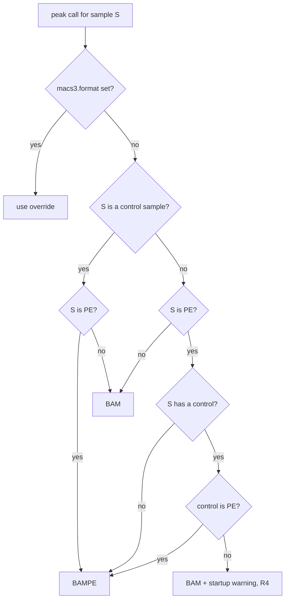

# Read Layout Handling - Plan

## Goal Capsule

- **Objective:** A user whose per-sample config correctly describes each sample's reads (single-end or paired-end, one or more lanes per mate) gets a run that uses all their reads and calls peaks in the right mode, without setting anything else by hand.
- **Means:** Derive layout-dependent choices from the per-sample config in one tested helper and wire it into the existing rules (KTD1).
- **Product authority:** This plan covers only audit group 1 (SE/PE and multi-lane correctness, audit items 1, 2, 5) from `docs/audits/2026-10-09-project-audit.md`. The other audit groups are not active scope. The Product Contract governs behavior; the Planning Contract governs how.
- **Stop conditions:** Stop and ask if MACS3 or bbduk turns out to need a different input shape than KTD2 and KTD3 assume.
- **Open blockers:** None.

---

## Product Contract

Product Contract preservation: Product Contract unchanged. The one Deferred-to-Planning question (how lanes merge and how subsampling counts them) is resolved by KTD3 and removed.

### Summary

The pipeline chooses the MACS3 read format for each peak call from the samples' layouts and keeps `macs3.format` only as an optional override. Paired-end samples accept several lane files per mate, as single-end samples already do. `genome_size` is accepted in plain or scientific notation and normalised for every tool, and a missing value stops the run early.

### Problem Frame

Read layout is declared twice today: per sample (whether `r2` is set) and globally (`macs3.format`). Users must keep the two in sync by hand. The lab's data is almost always paired-end and the default `BAMPE` matches, so nothing has broken in practice. But a single-end sample needs a manual switch to `BAM`. A paired-end TF with a single-end control, which the README's own example shows, cannot be configured correctly under one global format.

Two related defects sit in the same code path. `r1` already accepts a list of lane files, but the paired-end trimming step uses only the first R1 file and mishandles a list of R2 files. A correct multi-lane config therefore crashes or silently drops reads. And `genome_size` goes as the same raw value to MACS3 and to deeptools. The config comment says `"1e5"` notation works, but deeptools expects an integer. A null `genome_size` is not caught by the required-field check.

### Key Decisions

- **MACS3 format is chosen per peak call, with `macs3.format` kept as an override.** Users can no longer set a format that contradicts their samples by accident, but a deliberate choice is still possible. Governs R1, R2, R3. (session-settled: user-directed — chosen over removing the override, rejecting mixed treatment/control layouts at validation, and keeping a global format with an early error)
- **The PE→BAM fallback is surfaced only in the run log.** The report and results DB gain no per-sample format column. Governs R4, R5. (session-settled: user-directed — chosen over a per-sample report and DB column, and over silent fallback)
- **Multi-lane paired-end is supported rather than rejected.** This keeps paired-end consistent with single-end, which already accepts lane lists. Governs R6, R7. (session-settled: user-approved — proposed over rejecting lane lists with a clear error)

### Requirements

**MACS3 format selection**

- R1. A treatment peak call uses BAMPE when both the treatment and its control are paired-end, or when the treatment is paired-end and has no control; otherwise it uses BAM.
- R2. A control's self peak call uses BAMPE if the control is paired-end and BAM if it is single-end.
- R3. When `macs3.format` is set, it overrides the automatic choice for every call. When it is unset, which becomes the default, R1 and R2 apply.
- R4. When a paired-end treatment is called as BAM because its control is single-end, the run prints a warning at startup naming each affected sample and its control.
- R5. The results DB's run-level `macs3_format` value records the override when one is set and `auto` otherwise.

**Multi-lane input**

- R6. A paired-end sample may list several files for `r1` and for `r2`. Files pair by position, and all lanes are trimmed and carried forward, the same way single-end lane lists are today.
- R7. When a paired-end sample's `r1` and `r2` lists differ in length, the run stops at config validation with a message naming the sample and both counts.

**Genome size**

- R8. `genome_size` is accepted as an integer, an integer string, or scientific notation (e.g. `"2.7e9"`). The same whole-number value reaches every tool that consumes it.
- R9. A missing, non-numeric, or non-positive `genome_size` stops the run at config validation with a clear message.

**Documentation**

- R10. The README and both config files describe `macs3.format` as an optional override with automatic selection by default, document lane lists for `r1`/`r2`, and state the accepted `genome_size` forms.

### Acceptance Examples

- AE1. **Covers R1, R3.** Given TF_A (PE) with control input_A (PE) and `macs3.format` unset, when peaks are called, TF_A is called as BAMPE.
- AE2. **Covers R1, R2, R4.** Given TF_B (PE) with control input_B (SE) and `macs3.format` unset, when the run starts, a warning names TF_B and input_B. TF_B is called as BAM, and input_B's self call is BAM.
- AE3. **Covers R1.** Given TF_C (SE) with no control, TF_C is called as BAM.
- AE4. **Covers R3, R5.** Given `macs3.format: BAMPE` and an SE sample, every call uses BAMPE as the user asked, and the DB records `BAMPE`. MACS3 may then fail on the SE sample; that is the override's contract.
- AE5. **Covers R6.** Given a PE sample with `r1: [L1_R1, L2_R1]` and `r2: [L1_R2, L2_R2]`, the trimmed output contains read pairs from both lanes, and the trimming input count equals the sum over both lanes.
- AE6. **Covers R7.** Given a PE sample with two `r1` files and one `r2` file, the run stops before any job starts and names the sample and the counts 2 and 1.
- AE7. **Covers R8, R9.** Given `genome_size: "2.7e9"`, MACS3 and bamCoverage both receive `2700000000`. Given `genome_size: null`, the run stops at validation.

### Scope Boundaries

- MACS3 shortcut sizes (`hs`, `mm`, …) for `genome_size` are out of scope, because deeptools cannot consume them.
- No per-sample format column in the HTML report or results DB (see Key Decisions).
- Mixed lane counts across mates are rejected, not repaired (R7).
- Existing user configs that set `macs3.format: BAMPE` explicitly (copied from the old template) keep it as an override. They are not rewritten; the README notes that deleting the line enables automatic selection.
- Considered and not built: a startup warning when an explicit override contradicts a sample's layout. This rests on the Dependencies assumption that MACS3 fails loudly under `-f BAMPE` on a single-end BAM (AE4); U3's verification confirms it. If MACS3 instead runs and produces wrong peaks, build the warning.
- Other robustness items in the same rules (unquoted paths elsewhere, `temp()` on trimmed FASTQs, trimming reading inputs several times) belong to audit group F, not this plan.

### Deferred to Follow-Up Work

- The results DB records only the first lane's path for `r1`/`r2` (`workflow/scripts/update_db.py` `get_r1`/`get_r2`). Recording all lanes is a DB-schema change for audit group 4.

<!-- ce-section: work-relationships -->
### How This Work Fits Together

This plan covers audit group 1 from `docs/audits/2026-10-09-project-audit.md`. The breakdown below is the current understanding from that audit, not a committed roadmap.

- Config defaults & template (group 2): shares the README and config files that R10 edits; can proceed independently, but whichever lands second must reconcile the docs.
- Test suite repair (group 6): this plan adds tests under `tests/` that run with `pixi run python -m pytest tests`. Group 6 fixes the default `pytest` invocation and the stale tests; the two can proceed independently.
- Filtered-peak consistency, DB robustness, container reproducibility, docs & hygiene: can proceed independently of this plan.

### Dependencies / Assumptions

- Assumes MACS3 rejects single-end BAMs under `-f BAMPE` (behaviour not tested in this repo).
- Assumes deeptools' `--effectiveGenomeSize` requires an integer (not checked against deeptools source).

### Sources / Research

- `workflow/rules/trim.smk` (`trim_pe`): uses `R1_FILES[0]` and an unquoted `R2={input.r2}`. `trim_se` concatenates all R1 lanes.
- `workflow/rules/common.smk`: `get_r1` accepts a path or list. `SE_SAMPLES`/`PE_SAMPLES` are split per sample on `r2`. Path validation already handles `r2` lists. The required-field check omits `genome_size`.
- `workflow/rules/peaks.smk`: `macs3` and `macs3_control` both read the global `config["macs3"]["format"]` (default `BAMPE` in `config/config.yaml`). In rule `macs3`, control samples are called with themselves as `-c`.
- `workflow/rules/align.smk`: four `bamCoverage --effectiveGenomeSize` calls take the raw `genome_size`.
- `workflow/rules/db.smk`: records `macs3_format` and `genome_size` as run-level values.
- `README.md`: the options table says "Set to `BAM` for single-end data". The example config pairs a PE TF with an SE `input` control.

---

## Planning Contract

### Key Technical Decisions

- KTD1. **Layout decisions live in a pure-Python helper, `workflow/scripts/layout_utils.py`, imported by `common.smk`.** `common.smk` can't be imported by pytest. `tests/conftest.py` already puts `workflow/scripts/` on `sys.path`, so a helper there is testable with no new test setup. The rules keep only the wiring.
- KTD2. **Format is resolved through a per-wildcard params function, not a global constant.** Both MACS3 rules call one resolver with the sample, its control (or itself for control samples, per the existing `macs3` input logic), and the override. Implements R1–R3.
- KTD3. **For PE samples with more than one lane, `trim_pe` first joins each mate's lanes into one temporary file under `OUT/temp/{sample}/`, then runs the existing single-input bbduk/reformat path unchanged.** Lanes that are all gzip, or all plain, are byte-concatenated (concatenated gzip members form a valid gzip stream). A mate that mixes compressed and plain files is decompressed into a plain temp file. The temp files are deleted when the job ends. Single-lane samples skip the join, so nothing changes for today's runs. Fragment counting for `max_frags` reads the joined R1 file, so the count covers all lanes (AE5). Chosen over passing comma-separated lists to BBTools, whose multi-input support is unverified for paired `in1`/`in2`. Implements R6.
- KTD4. **The fallback warning is printed from the Snakefile `onstart` handler.** `onstart` runs once in the main process. Printing during `common.smk` parsing would repeat the warning in every cluster job's log. Implements R4.
- KTD5. **The normalised `genome_size` integer is computed once in `common.smk` as `GENOME_SIZE`.** Every rule that consumed `config["genome_size"]` uses it instead. Parsing uses exact decimal arithmetic and rejects non-integral results, so `"2.7e9"` becomes `2700000000` with no float rounding. Implements R8, R9.
- KTD6. **The default `macs3.format` becomes `null` in `config/config.yaml` and the root `config.yaml` template.** Under Snakemake's recursive config merge, a non-null default would always act as the override. Implements R3.

### High-Level Technical Design

MACS3 format resolution for one peak call (applies to both `macs3` and `macs3_control`):

---

## Implementation Units

### U1. Layout helper module

- **Goal:** Pure functions for format resolution, fallback detection, lane-list normalisation and validation, and `genome_size` parsing.
- **Requirements:** R1, R2, R3, R4 (which samples trigger it), R7, R8, R9.
- **Dependencies:** None.
- **Files:** `workflow/scripts/layout_utils.py` (new), `tests/test_layout_utils.py` (new).
- **Approach:**
  1. Lane normalisation: turn a sample's `r1`/`r2` value (null, path, or list) into a list, mirroring `get_r1` in `common.smk`.
  2. Lane validation: for PE samples, return one error string per sample whose `r1`/`r2` list lengths differ, naming both counts (R7).
  3. Format resolver: inputs are the sample, its control (or none), the PE sample set, the control sample set, and the override (KTD2, per the flowchart).
  4. Fallback finder: list the (treatment, control) pairs where a PE treatment drops to BAM. Return nothing when an override is set.
  5. `genome_size` parser: accepts int, digit string, or scientific notation; raises `ValueError` with a clear message for null, non-numeric, non-integral, or non-positive values (KTD5).
- **Patterns to follow:** The existing error style in `common.smk` (collect `"  ..."` lines, raise one `ValueError`). Module layout and docstrings follow `workflow/scripts/logo_utils.py`.
- **Test scenarios:**
  - Covers AE1. Treatment PE, control PE, no override → BAMPE.
  - Covers AE2. Treatment PE, control SE, no override → BAM, and the fallback finder returns that pair.
  - Covers AE3. Treatment SE, no control → BAM.
  - Treatment PE, no control → BAMPE.
  - Control sample PE → BAMPE; control sample SE → BAM.
  - Covers AE4. Override `BAMPE` with an SE sample → BAMPE, and the fallback finder returns nothing.
  - Lane normalisation: null → empty list; single path → one-item list; list → same list.
  - Covers AE6. PE sample with 2 `r1` and 1 `r2` → one error naming the sample, 2 and 1.
  - Equal-length lists and single paths → no errors; SE samples are never flagged.
  - Covers AE7. `"2.7e9"` → 2700000000; `3000000000` (int) → same int; `"3000000000"` → int.
  - `None`, `"abc"`, `"0"`, `"-5"`, `"1.5"` → `ValueError`.
- **Verification:** `tests/test_layout_utils.py` passes and every case above is covered.

### U2. Validation and constants in `common.smk`

- **Goal:** Fail fast on bad lane counts or `genome_size`, and expose the resolved values to the rules.
- **Requirements:** R7, R8, R9, R3 (override read).
- **Dependencies:** U1.
- **Files:** `workflow/rules/common.smk`.
- **Approach:**
  1. Import the helper. Put `workflow/scripts` on `sys.path` first, using `workflow.basedir` (`SCRIPTS` is defined later in the file, so build the path at the import).
  2. Add `genome_size` to `_missing_fields` only when it is null. Report a non-numeric, non-integral or non-positive value with the U1 parser's message under its own "Invalid config value(s)" header, so a set-but-wrong value is never reported as "not set".
  3. Raise lane-count errors in the same exception as the path errors, under their own "Mismatched r1/r2 lane counts" header rather than "file paths ... do not exist", so both kinds of error surface together.
  4. Define `GENOME_SIZE`, `MACS3_FORMAT_OVERRIDE` (`config["macs3"].get("format")`, empty treated as unset), and a `get_r2` helper parallel to `get_r1`.
  5. Define a `macs3_format(wc)` params helper that calls the U1 resolver with `SAMPLE_CONTROL`, `PE_SAMPLES`, `CONTROL_SAMPLES` and the override.
- **Patterns to follow:** The existing `_missing_fields` and `_path_errors` blocks in `common.smk`.
- **Test scenarios:** Test expectation: none -- thin wiring over U1; behaviour is proven by U1's tests and the U3/U4 dry-run checks.
- **Verification:** `snakemake -n` with a config whose `genome_size` is null stops with a message naming `genome_size`. A config with mismatched PE lane lists stops before any job and names the sample and both counts.

### U3. Per-call MACS3 format, normalised genome size, DB value, startup warning

- **Goal:** Rules consume the resolved values; the fallback warning appears once.
- **Requirements:** R1–R5, R8.
- **Dependencies:** U2.
- **Files:** `workflow/rules/peaks.smk`, `workflow/rules/align.smk`, `workflow/rules/db.smk`, `workflow/Snakefile`.
- **Approach:**
  1. `peaks.smk`: both MACS3 rules set `macs3_format` from the U2 helper (KTD2) and `genome_size` from `GENOME_SIZE`.
  2. `align.smk`: all four `bamCoverage` `genome_size` params use `GENOME_SIZE`.
  3. `db.smk`: `macs3_format` becomes the override or `"auto"` (R5); `genome_size` uses `GENOME_SIZE`.
  4. `Snakefile` `onstart`: compute fallback pairs with the U1 helper and log one warning line per pair naming treatment and control (KTD4). Log through Snakemake's `logger` if it is reachable from `onstart`, otherwise print to stderr.
- **Patterns to follow:** The existing per-wildcard params lambdas in `peaks.smk` (`ctrl`, `nomodel`).
- **Test scenarios:** Test expectation: none -- rule wiring; decision logic is covered in U1. Verified by the dry-run checks below.
- **Verification:**
  - `snakemake -n -p` on a config with a PE TF + SE control and no override shows `-f BAM` for that TF and the control's self call, and `-f BAMPE` for a PE TF with a PE control (AE1, AE2).
  - With `macs3.format: BAMPE` set, every MACS3 command in the dry run shows `-f BAMPE` (AE4).
  - `genome_size: "2.7e9"` shows `2700000000` in both the MACS3 and bamCoverage commands (AE7).
  - Snakemake skips `onstart` under `-n`, and also when there is nothing to do. So check the startup warning with a real run of the same scenario configs limited to a cheap target (e.g. `--until trim_pe` on the U4 fixture). The PE TF + SE control config prints the warning naming both samples (AE2). The `macs3.format: BAMPE` config prints none (AE4).
  - Run MACS3 `callpeak -f BAMPE` once on a small single-end BAM and confirm it fails with an error rather than producing peaks. This confirms the Dependencies assumption that the override-conflict warning was not built on.

### U4. Multi-lane paired-end trimming

- **Goal:** `trim_pe` trims every lane of both mates, paired by position.
- **Requirements:** R6.
- **Dependencies:** U2 (`get_r2`, lane validation).
- **Files:** `workflow/rules/trim.smk`.
- **Approach:**
  1. `trim_pe` input `r2` uses `get_r2` so a list becomes a list of files.
  2. The shell builds `R1_FILES`/`R2_FILES` arrays. When either array has more than one entry, the shell joins each mate into a temp file under `OUT/temp/{sample}/`, as KTD3 describes. Remove the temp directory on exit, even after a failure.
  3. `R1`/`R2` then point at either the single original file or the joined file, quoted. The existing count/subsample/trim branches run unchanged.
- **Execution note:** This is shell-in-rule work with no unit-test harness. Prove it with a tiny two-lane PE fixture run through the rule, not only a dry run.
- **Patterns to follow:** `trim_se`'s lane loop and gzip detection (`gzip -t`) in the same file.
- **Test scenarios:**
  - Covers AE5. Two-lane PE fixture (a few hundred read pairs per lane, gzip): trimmed R1 and R2 hold pairs from both lanes, and the subsample log's input count equals the sum of both lanes' reads.
  - Single-lane PE sample: the commands match today's except for quoting, and no temp directory is created.
  - A mate mixing a `.fastq.gz` lane and a plain `.fastq` lane trims without error.
- **Verification:** The fixture run passes all three scenarios. `OUT/temp/{sample}/` is gone afterwards.

### U5. Documentation and config defaults

- **Goal:** Users see the new defaults and accepted forms.
- **Requirements:** R10, R3 (default), KTD6.
- **Dependencies:** U3, U4.
- **Files:** `README.md`, `config/config.yaml`, `config.yaml`.
- **Approach:**
  1. In `config/config.yaml` and `config.yaml`, set `macs3.format: null` with a comment explaining automatic selection and the override.
  2. State the accepted `genome_size` forms from R8 in a comment above `genome_size` in both `config.yaml` (replacing its `"1e5"` comment) and `config/config.yaml`.
  3. Show a lane-list example for `r1`/`r2` in the sample comments.
  4. README: rewrite the `macs3.format` row in the options table. Add one line telling existing configs to delete `format: BAMPE` to get automatic selection. Document lane lists and the `genome_size` forms.
- **Test scenarios:** Test expectation: none -- documentation and default values only.
- **Verification:** No README or config text still says single-end needs `format: BAM` set by hand. `snakemake -n` with the root template (paths filled) still parses.

---

## Verification Contract

| Check | Command / method | Proves |
|---|---|---|
| Unit tests | `pixi run python -m pytest tests/test_layout_utils.py` | U1 logic, AE1–AE4, AE6, AE7 |
| Existing suite | `pixi run python -m pytest tests`, compared against the baseline of 84 passed and 10 known-stale failures in `tests/test_narrow_peak_to_fasta.py` | No regressions; the stale failures belong to audit group 6 |
| Dry runs | `pixi run snakemake -n -p --configfile <scenario config>` for each U2/U3 scenario | Validation errors, per-call `-f`, normalised genome size |
| Startup warning | Real run with `--until trim_pe` on the fallback and override scenario configs (`onstart` does not run under `-n`) | R4, AE2, AE4 |
| Lane fixture | Run `trim_pe` on the two-lane fixture inside the pipeline container | AE5, KTD3 |

Do not run plain `pytest` from the repo root; it currently walks into `apptainer_build/dapseq_sandbox/` (audit item 15).

## Definition of Done

- Every unit's Verification holds, and the Verification Contract checks pass. The existing suite has no new failures beyond the 10 known stale ones.
- Every R1–R10 is satisfied, and AE1–AE7 behave as written.
- A single-lane, all-PE config with `macs3.format` unset produces the same MACS3, bowtie2 and bamCoverage commands as before, apart from quoting.
- Scratch configs, fixture data outside `tests/`, and any code from abandoned approaches are removed from the diff.
