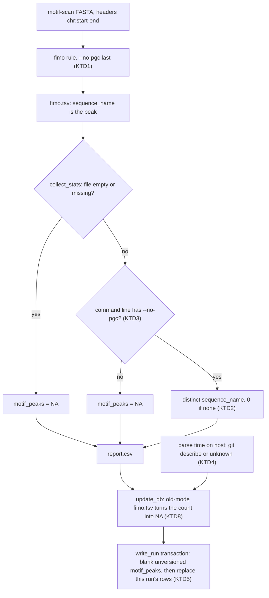

# Motif Peaks Count - Plan

## Goal Capsule

- **Objective:** When someone reads `motif_peaks` in a run's report or in the shared results database, they see either the real number of scanned peaks that contain a discovered motif, or no value. They never see a wrong one.
- **Means:** FIMO names each hit by its peak (KTD1). The stats step counts those names (KTD2, KTD3). Each database write stamps the pipeline version (KTD4), blanks `motif_peaks` on rows that have no version (KTD5), and refuses counts that came from old-mode FIMO output (KTD8).
- **Product authority:** This plan covers only `motif_peaks` from audit group 1 in `docs/audits/2026-10-09-project-audit-2.md`:
  - Items 1, 2 and 32.
  - The version marker from item 18.
  - The `num_peaks*` wording from item 7.

  The rest of group 1 and audit groups 2–6 are not active scope. Every other QC stat stays as it is. The Product Contract governs behavior; the Planning Contract governs how.
- **Execution profile:** U1–U3 in one pull request branched from `origin/main`. U1 and U2 must ship together (see Sequencing).
- **Stop conditions:** Stop and ask if either of these turns out to be false:
  - The container's FIMO is 5.5.9.
  - `--no-pgc` keeps the FASTA header as `sequence_name`, as KTD1 assumes.
- **Open blockers:** None.

---

## Product Contract

Product Contract preservation, changed:
- **R2** now also reads NA for FIMO output made in the old coordinate mode. Confirmed at plan scoping.
- **AE6** is added.
- **Problem Frame and Dependencies / Assumptions** are corrected because PR #13 already merged.
- **Outstanding Questions:** the old-checkout assumption is resolved by KTD5. The three Deferred-to-Planning questions are resolved by KTD1, KTD4 and KTD5 and removed.
- **Scope Boundaries** gains a "Considered and not built" list.

### Summary

`motif_peaks` counts the peaks in the motif-scan FASTA that have at least one FIMO hit. Today it counts the chromosomes those peaks sit on. It reads 0 when FIMO ran and found nothing. The `motif_peaks` values already in the shared database are blanked, and new rows record the pipeline version. The README and the report header say what `motif_peaks` and `num_peaks*` count.

### Problem Frame

`motif_peaks` is a QC stat the lab watches.
The FASTA given to FIMO uses `chr:start-end` headers, and FIMO reads such headers as genome coordinates, so for each hit it reports only the chromosome. The stats step counts distinct values of that field.
Every report and database row since this code was written therefore holds the number of chromosomes with a hit. An Arabidopsis run can never show more than 7. On a simulated run, 17 of 20 peaks had a hit and `motif_peaks` came out as 2.

A same-day fix (930143c) was meant to make zero hits read as 0. Real FIMO 5.5.9 writes no header row when nothing matches, so zero hits still read as NA.
The tests passed because their FIMO fixtures use made-up peak names that FIMO never writes in this mode. The README "What's changed" section, merged in #13, claims the 0 behavior works.

### Key Decisions

- **`motif_peaks` keeps its meaning; only the count is fixed.** It still counts peaks in the motif-scan FASTA that have a hit from any discovered motif. That FASTA is the top `meme.maxpeaks` peaks by fold-change, the set MEME learns from. Governs R1, R2. (session-settled: user-directed — chosen over redefining it to describe all filtered peaks: it is an established QC stat the lab relies on as defined)
- **The count comes from FIMO's own output, not new pipeline logic.** The lab wants its own code to compute as few stats as possible. Governs R3. (session-settled: user-approved — chosen over keeping genome coordinates and mapping each hit back to its peak in pipeline code: "let the established software do this")
- **Existing database values are blanked, and new rows record the pipeline version.** Every stored value is wrong, and re-running a project restores the real number. Governs R5, R6. (session-settled: user-approved — chosen over recomputing old values from files on disk, and over leaving them with only a version marker)
- **`num_peaks*` stay MACS3 summit-row counts and are documented as such.** Governs R8. (session-settled: user-approved — chosen over counting distinct peak regions, and over adding region-count columns)
- **The filtered-peak stats stay as they are.**
  - `chrom_filter` keeps shaping only the MEME/FIMO FASTA.
  - `reads_in_peaks_filt`, `frip_filt`, `max_peak_score`, HOMER and the database's filtered-peak path are untouched.

  (session-settled: user-directed — chosen over applying `chrom_filter` to them, audit item 3: "the filtered-peak stat is correct as is")

### Requirements

**Count**

- R1. `motif_peaks` equals the number of distinct peaks in the motif-scan FASTA that have at least one FIMO hit at `fimo.thresh`.
- R2. When FIMO ran and reported no hits, `motif_peaks` is 0. It is NA in two cases:
  - FIMO produced no output, for example when MEME had no input sequences.
  - The output came from the old coordinate mode, which names hits by chromosome.
- R3. The count identifies each hit's peak from FIMO's output; no pipeline code maps hit positions back to peak intervals.
- R4. Tests check `motif_peaks` against output shaped exactly like FIMO 5.5.9 run with the pipeline's flags. They cover four cases: hits across several peaks on one chromosome, no hits, no output, and old-mode output.

**Results database**

- R5. On the first run after the upgrade, every `motif_peaks` value already stored in the shared database becomes NA, and no other stored value changes.
- R6. Every row written after the upgrade records the pipeline version that produced it.

**Documentation**

- R7. The README and the HTML report header define `motif_peaks` in one line and say it counts out of at most `meme.maxpeaks` peaks.
- R8. The README and the HTML report header say that `num_peaks`, `num_peaks_filt`, `num_peaks_bl` and `num_peaks_rmsk` count MACS3 summits, and that one peak region can have several.
- R9. The README "What's changed" section drops the false "`motif_peaks` is `0`" line. In its place it says three things:
  - `motif_peaks` used to count chromosomes.
  - Stored values were blanked.
  - Re-running a project restores them.

### Acceptance Examples

- AE1. **Covers R1, R3.** **Given** a motif-scan FASTA with three peaks, two on `chr1` and one on `chr2`, each with a FIMO hit, **when** stats are collected, **then** `motif_peaks` is 3. Today it is 2.
- AE2. **Covers R1.** **Given** one peak with four hits from two different motifs, **then** that peak counts once.
- AE3. **Covers R2.** **Given** FIMO ran on a non-empty FASTA and matched nothing, **then** `motif_peaks` is 0.
- AE4. **Covers R2.** **Given** MEME had no sequences to learn from, so FIMO did not run, **then** `motif_peaks` is NA.
- AE5. **Covers R5, R6.** **Given** a shared database holding rows from earlier runs, **when** the first upgraded run writes its rows, **then** every earlier row shows NA for `motif_peaks` and keeps its other columns, and the new rows carry a pipeline version.
- AE6. **Covers R2.** **Given** a `fimo.tsv` left over from a run that used the old coordinate mode, **when** stats are collected with the new code, **then** `motif_peaks` is NA, not a chromosome count.

### Scope Boundaries

- Every other QC stat, including the `_filt` stats when `chrom_filter` is set (audit item 3) and the `num_peaks*` values themselves.
- Recomputing old `motif_peaks` values from files still on disk.
- Rewriting `report.csv` or `report.html` in existing output folders. They keep the wrong value until that run is redone.
- Recording peak-filter settings (blacklist, repeat, chromosome) in database rows.
- Scanning more peaks than `meme.maxpeaks`, and MEME's 100,000-letter search sampling (audit item 5, group 2).
- Audit groups 2–6.

#### Considered and not built

- **Forcing FIMO to re-run by changing its output path.** KTD3 already stops a stale file from being counted, without moving a path the database records. This would only be needed if FIMO stopped writing its command line into `fimo.tsv`.
- **Reading the version straight from `.git` files instead of calling `git`.** The `safe.directory` override plus the `unknown` fallback (KTD4) covers the shared checkout. This would only be needed if many rows came back `unknown` on the cluster.

### Dependencies / Assumptions

- PR #13 merged the "What's changed" section, and with it the false line R9 removes, into `main`. This work branches from `origin/main`. Local `main` is stale.
- Assumed: nobody relies on genome coordinates in the FIMO output files.
  - Under KTD1, the start/stop columns of `fimo.tsv`, and the coordinates in `fimo.gff` and `best_site.narrowPeak`, become positions within the peak for both scans. The peak's genome location stays in the sequence name.
  - Inside the pipeline only the stats step reads `fimo.tsv`. The database stores its path so people can open it, and nothing reads the other two files.

### Sources / Research

- `docs/audits/2026-10-09-project-audit-2.md` items 1, 2, 7, 18 and 32.
- FIMO flags and FASTA headers:
  - `workflow/rules/motifs.smk:37` (`fimocoords = True`) and `:218` (the FIMO command).
  - `workflow/scripts/narrow_peak_to_fasta.py:73-74` (the `maxpeaks` cap) and `:111-112` (header format).
- Count and its consumers:
  - `workflow/rules/stats.smk:16`: only the peaks-mode FIMO output feeds stats.
  - `workflow/scripts/collect_stats.py:174-194`: the current count.
  - `workflow/scripts/update_db.py:27-64` (columns), `:127-141` (column migration) and `:202-216` (`write_run`).
  - `workflow/scripts/report.py:191-207`: the report header text.
- `tests/test_stats_parsers.py:44-62`: the current FIMO fixtures.
- MEME learns from a copy of the FASTA with sequences shorter than `meme.minw` removed (`workflow/rules/motifs.smk:157`). FIMO scans the full FASTA.

---

## Planning Contract

### Key Technical Decisions

- KTD1. **Both FIMO scans run with `--no-pgc`, placed after `{params.extra}`.**
  - FIMO 5.5.9 reads `chr:start-end` headers as genome coordinates by default. Today's `--parse-genomic-coord` is a leftover spelling of that default.
  - `--no-pgc` is FIMO's switch that keeps the header as `sequence_name`. FIMO honors the last flag it sees, so putting it after the user's extra options stops them from turning parsing back on.
  - One `fimo` rule serves both scans. Keeping both scans the same avoids a peak-type branch for the summits scan, which feeds no stat.

  Implements R3. (session-settled: user-approved — chosen over changing only the peaks scan: confirmed at plan scoping, with the side effect on `fimo.gff` and `best_site.narrowPeak` shown)
- KTD2. **"FIMO ran" means `fimo.tsv` is non-empty, and the count is distinct `sequence_name` values over data rows.**
  - When MEME had no input, the rule creates an empty file with `touch`.
  - Real FIMO always writes its blank line and `#` trailer, even with zero hits.

  So file size alone separates R2's no-output case from its zero-hit case, without depending on the header row. Implements R1, R2.
- KTD3. **A non-empty `fimo.tsv` whose `# fimo` command-line comment lacks `--no-pgc` reads NA.**
  - FIMO writes its own command line into the file. Checking it stops an old-mode file from being counted as chromosomes under a new version stamp.
  - An old-mode file can survive in two ways: a run was in flight during the upgrade, or Snakemake re-runs the stats step (a script rule, re-run on mtime) without re-running FIMO.

  Implements R2's old-mode clause. (session-settled: user-approved — chosen over trusting any existing `fimo.tsv`: confirmed at plan scoping)
- KTD4. **The version is the checkout's `git describe --always --dirty`, computed on the host when Snakemake parses the workflow, and passed to `update_db` as a rule param.**
  - The container has no `git`, so the value cannot be computed inside the rule.
  - The call passes `-c safe.directory=*`, so git does not refuse other lab members' runs from the shared checkout for "dubious ownership". It also uses a short timeout.
  - Any failure gives `unknown`; the value is never empty.

  (session-settled: user-approved — chosen over leaving the version empty when it cannot be read: an empty version would get the row blanked)
- KTD5. **Blanking is one UPDATE, run first inside `write_run`'s existing transaction. It sets `motif_peaks` to `'NA'` on every `pipeline_runs` row whose version is NULL.**
  - `ALTER TABLE ADD COLUMN` leaves pre-upgrade rows NULL, but it commits on its own. Keying on "column just added" could therefore be lost to a crash or to a concurrent run.
  - Keying on NULL is idempotent, catches rows an older checkout writes later, and commits with the run's own DELETE and INSERT.
  - `'NA'` matches how every other missing stat is stored.

  Implements R5. (session-settled: user-approved — chosen over blanking once when the column is first added: confirmed at plan scoping)
- KTD6. **`pipeline_version` is added to both `pipeline_runs` and `run_metadata`.** R6 covers every row, and `_ensure_columns` already migrates both tables. Implements R6.
- KTD7. **The new header text is static and shown whether or not the filter paragraph is.** It names `meme.maxpeaks` without its value: passing the number would mean adding it to three callers and the snapshot reader. Implements R7, R8.
- KTD8. **`update_db` applies KTD3's old-mode check to each sample's peaks `fimo.tsv` before storing `motif_peaks`.**
  - A version stamp records the code that wrote the row, not the code that computed the value. Two paths would otherwise store an old `report.csv` chromosome count under the new version:
    - a run in flight during the upgrade;
    - a re-run under `--rerun-triggers mtime` that re-runs only the database step.
  - The count itself still comes from `report.csv`. The check only turns a stale count into NA, using the `fimo.tsv` path that `run_metadata` already records.

  Implements R5 and R6, and completes KTD3's purpose.

### High-Level Technical Design

Where each change lands on the path a `motif_peaks` value takes. Changed steps are marked with their KTD.



Order inside `write_run`, as directional guidance:

```text
create tables if missing; add missing columns          (each autocommits, as today)
transaction:
  blank motif_peaks where pipeline_version is null     (KTD5)
  replace this output_dir's pipeline_runs rows
  replace this output_dir's run_metadata rows
commit
```

### Sequencing

- U2 reuses U1's old-mode check (KTD8), so build U1 first. Both must merge together. If U2 shipped alone, new rows would get a version stamp over chromosome counts. If U1 shipped alone, nothing would mark the old values as wrong.
- U3 depends on U1 and U2, because it documents their behavior.

---

## Implementation Units

### U1. Name FIMO hits by peak and count peaks

- **Goal:** `motif_peaks` counts peaks. It reads 0 on no hits, and NA for no output or old-mode output.
- **Requirements:** R1, R2, R3, R4; KTD1, KTD2, KTD3.
- **Dependencies:** None.
- **Files:**
  - `workflow/rules/motifs.smk` (the `fimo` rule)
  - `workflow/scripts/collect_stats.py` (`_fimo_motif_peaks`)
  - `tests/test_stats_parsers.py`
- **Approach:**
  1. In the `fimo` rule, replace `--parse-genomic-coord` with `--no-pgc`, placed after `{params.extra}` (KTD1).
  2. Rewrite `_fimo_motif_peaks` per KTD2 and KTD3. Skip blank lines, `#` lines and the `motif_id` header row when collecting names. Update its docstring to the new NA/0 meaning.
  3. Replace the FIMO fixtures with string constants copied verbatim from real FIMO 5.5.9 output.
     - Generate them with `apptainer_build/.pixi/envs/default/bin/fimo` on a small motif file and FASTA. Use `--no-pgc` for the new cases and the current flags for the old-mode cases.
     - CI has no FIMO, so the fixtures live in the test module and are not generated at test time.
- **Execution note:** Capture the real FIMO outputs first, and confirm the current parser gives 2 and NA on them, before changing the parser.
- **Patterns to follow:**
  - The `_write` helper and the module-level fixture constants in `tests/test_stats_parsers.py`.
  - The `NA` constant in `collect_stats.py`.
- **Test scenarios:**
  - Covers AE1. `--no-pgc` output with hits in three peaks, two on `chr1` and one on `chr2` → `"3"`.
  - Covers AE2. One peak with four hit rows from two motif IDs → `"1"`.
  - Covers AE3. Real `--no-pgc` no-hit file (a blank line and three `#` lines, no header) → `"0"`.
  - Covers AE4. Empty file, as the rule creates it with `touch` → `"NA"`. Missing path → `"NA"`.
  - Covers AE6. Real old-mode file with hits (`sequence_name` is `chr1`) → `"NA"`. Old-mode no-hit file → `"NA"`.
  - Hit rows sorted by p-value, with peaks interleaved → still the distinct peak count.
- **Verification:** The parser tests pass. In a dry run printing shell commands, every `fimo` job's command has `--no-pgc` after the extra options.

### U2. Stamp database rows with the pipeline version and blank unversioned values

- **Goal:** Every new database row carries a version, and no row without one shows a `motif_peaks` value.
- **Requirements:** R5, R6; KTD4, KTD5, KTD6, KTD8.
- **Dependencies:** U1, for its old-mode check (KTD8). Merges together with U1 (see Sequencing).
- **Files:**
  - `workflow/scripts/pipeline_version.py` (new helper)
  - `workflow/rules/common.smk` (compute the version once at parse time)
  - `workflow/rules/db.smk` (pass it as a param)
  - `workflow/scripts/update_db.py`
  - `tests/test_pipeline_version.py` (new)
  - `tests/test_update_db.py`
  - `tests/test_peak_set_consistency.py`
- **Approach:**
  1. The helper returns the version for a given checkout directory per KTD4.
  2. `common.smk` imports it the way it imports `layout_utils` and `sample_names`, and computes one module-level value from the repository root (the parent of `workflow.basedir`).
  3. `db.smk` passes that value as `pipeline_version`.
  4. In `update_db.py`:
     - Add `pipeline_version` to `COLS` and `META_COLS` (KTD6).
     - Put `sm.params.pipeline_version or "unknown"` into the run-level fields built in `main()`.
     - Run the KTD5 UPDATE as the first statement inside `write_run`'s existing transaction, before both replaces.
     - When building each sample's `pipeline_runs` row in `main()`, apply U1's old-mode check to that sample's peaks `fimo.tsv` (the path `run_metadata` records), and store `'NA'` when it fails (KTD8). Import the check from `collect_stats` the way `render_meme_logo.py` imports `logo_utils`.
  5. Add `pipeline_version` to `_run_main`'s params in `tests/test_update_db.py`, and to the `run_level` set in `tests/test_peak_set_consistency.py`.
- **Patterns to follow:**
  - `test_write_rows_migrates_legacy_schema`, for a legacy-schema database built with raw `sqlite3`.
  - `test_write_run_is_atomic_across_both_tables`, for a write that fails.
  - The monkeypatched `snakemake` `SimpleNamespace` in `_run_main`.
  - The scripts' dual-mode `if "snakemake" in dir()` convention.
- **Test scenarios:**
  - Covers AE5. A legacy database holds a project-A row with `motif_peaks` `'17'` and `num_peaks` `'120'`, and has no version column. `write_run` for project B leaves A's `motif_peaks` `'NA'` and its `num_peaks` `'120'`. B's rows carry the version in both tables.
  - A second `write_run` for project B changes nothing on A's row, replaces B's rows, and keeps them versioned.
  - A row inserted later without a version (naming only the old columns, as an older checkout would) is blanked by the next `write_run`. A versioned row with `motif_peaks` `'5'` is left alone.
  - A row whose version is `'unknown'` is not blanked.
  - A failed write (wrong meta-row arity, as in the atomicity test) commits no blanking.
  - `main()` with a `pipeline_version` param writes it into the rows. `main()` with an empty param writes `'unknown'`.
  - Covers AE6. `main()` with a `report.csv` saying `motif_peaks` is `'2'`, for a sample whose peaks `fimo.tsv` is the old-mode fixture, stores `'NA'`. With a `--no-pgc` fixture, it stores `'2'`.
  - The version helper with `subprocess` monkeypatched, so no real git is used:
    - git succeeds → its output with whitespace stripped.
    - git is missing → `'unknown'`.
    - git exits non-zero → `'unknown'`.
    - git times out → `'unknown'`.
- **Verification:** The database and helper tests pass. Running only the database step against a scratch output folder (see the Verification Contract) writes rows whose `pipeline_version` matches the checkout's `git describe --always --dirty`.

### U3. Document `motif_peaks`, `num_peaks*` and the upgrade

- **Goal:** Readers of the report and the README know what these columns count and what changed.
- **Requirements:** R7, R8, R9; KTD7.
- **Dependencies:** U1, U2.
- **Files:**
  - `workflow/scripts/report.py` (`_report_header_html`)
  - `README.md`
  - `tests/test_peak_set_consistency.py`
- **Approach:**
  1. Add a static paragraph to the report header. It defines `motif_peaks` as peaks among the top `meme.maxpeaks` motif-scan peaks with at least one FIMO hit. It also says that `num_peaks*` count MACS3 summits, and that one peak region can have several. Show it even when `filter_foldch` is None (KTD7). Avoid the phrases "Experiment date" and "gDNA batch", which an existing test checks are absent.
  2. In the README:
     - Replace the false line in "What's changed" (`README.md:23`) per R9. Add that if `motif_peaks` still reads NA after a re-run, adding `--forcerun fimo` re-scans and restores it. This is needed with `--rerun-triggers mtime`, or when Snakemake has no record of the project's earlier FIMO run.
     - Add a "Results database" bullet for `pipeline_version` and the blanking.
     - Add a short column note near the Outputs table. It defines `motif_peaks`, and says that `num_peaks*` count MACS3 summits and that one peak region can have several.
     - In the FIMO row of the Outputs table, say that positions are within the peak and that the sequence name is the peak's location.
- **Test scenarios:**
  - With `filter_foldch` set, the header HTML contains the `motif_peaks` definition and the summit note.
  - With `filter_foldch` None, the header HTML still contains both.
  - The existing check that the HTML has no "Experiment date" or "gDNA batch" still passes.
- **Verification:** The header tests pass. A report rendered by the test helper shows the paragraph, and the README sections read correctly against U1's and U2's behavior.

---

## Risks & Dependencies

- **Compute nodes without `git`:** rows written from those jobs say `unknown`. They are still correct and never blanked, just less traceable. If that happens a lot on the cluster, see "Considered and not built".
- **Re-stamping:** a new commit changes the `update_db` param. Re-invoking the pipeline on an existing project re-writes its rows from the existing `report.csv`, which also refreshes `run_date` and `author` on those rows. This is accepted: it happens only when someone runs that project.
- **FIMO's stored-hit cap:** FIMO keeps at most 100,000 hits (`--max-stored-scores`). With today's `maxpeaks` and `nmotifs` this is far away; only a very large `meme.maxpeaks` would reach it. Out of scope.

## System-Wide Impact

- **Shared database:** the first upgraded run by any lab member blanks `motif_peaks` on every other project's unversioned rows (R5). Later runs repeat the same UPDATE, which by then matches nothing, or only rows from stale checkouts.
- **FIMO output files:** both scans' output files change coordinate style (see Dependencies / Assumptions).

---

## Verification Contract

| Check | How | Proves |
|---|---|---|
| Unit tests | `pixi run test` (CI runs the same on every PR; no `git` or FIMO needed) | U1–U3 |
| FIMO command | `pixi run snakemake -n -p` against a scratch config with one PE sample: each `fimo` job ends its options with `--no-pgc` after the extra options | U1, KTD1 |
| Version stamp | A dry run does not print rule params, so check the stored value instead. Make a scratch output folder holding a hand-written `stats/report.csv`, and a scratch config whose `db_path` is in scratch. Run only the database step: `pixi run snakemake <scratch_out>/stats/db_updated.flag --rerun-triggers mtime --configfile <scratch config>`. Then use `sqlite3` to confirm that `pipeline_version` in both tables equals the checkout's `git describe --always --dirty` | U2, KTD4 |
| Fixture fidelity | The fixture constants match output from `apptainer_build/.pixi/envs/default/bin/fimo` (`--version` prints 5.5.9) | U1, R4 |

No container rebuild is needed; no packages change.

---

## Definition of Done

- R1–R9 hold, and AE1–AE6 each have a passing test.
- `pixi run test` passes.
- The only new database column is `pipeline_version`, and no other stat's value or meaning changes.
- U1–U3 land in one pull request from `origin/main`. It also carries `docs/audits/2026-10-09-project-audit-2.md` and this plan.
- No leftover code from abandoned approaches is in the diff.
